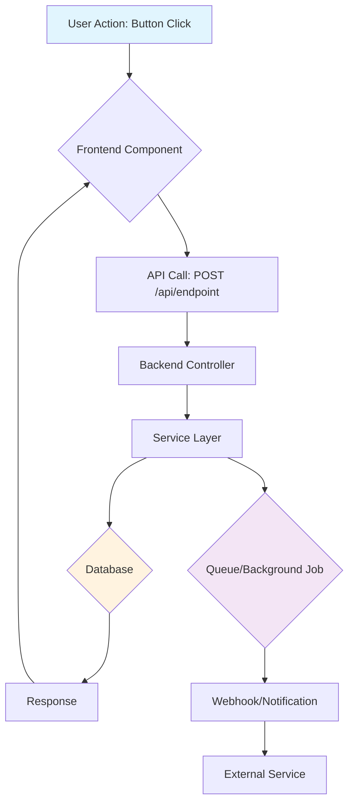
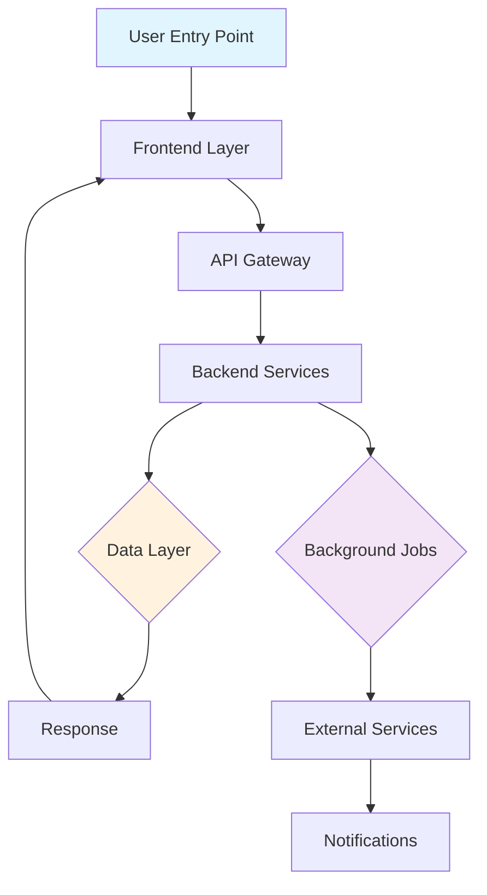
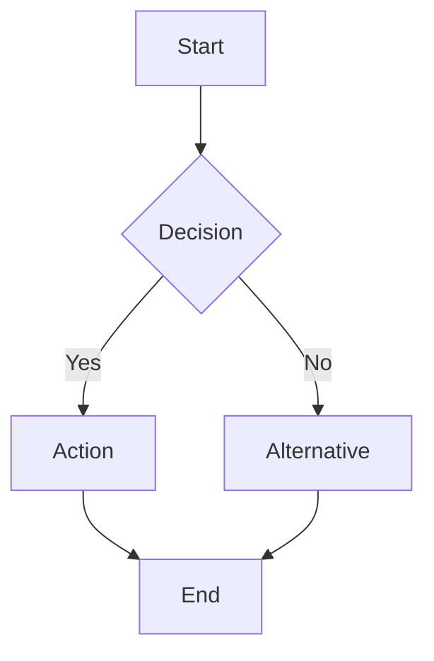

# Update Documentation - Session Continuity Command

This command ensures comprehensive tracking of all work, decisions, and context for session continuity.

> **Note for Solo Developers:** This focuses on WHAT was done and WHY, not time estimates or velocity metrics. Just build and document. No sprints, no burndown charts, no estimates.

## 🚨 CRITICAL RULE: NO .MD FILES AT WORKSPACE ROOT

**⛔ NEVER CREATE .MD FILES AT WORKSPACE ROOT LEVEL**

**ONLY 4 files allowed at root:**

- ✅ `AGENTS.md` - Navigation file
- ✅ `CLAUDE.md` - AI agent config
- ✅ `CODEX.md` - AI agent config
- ✅ `README.md` - Project README

**❌ FORBIDDEN at root:**

- ❌ `MIGRATION-STATUS.md`
- ❌ `COMPLETE-*.md`
- ❌ `IMPLEMENTATION-*.md`
- ❌ `READY-TO-TEST.md`
- ❌ ANY other .md files

**✅ WHERE TO PUT THEM:**

| File Type             | Correct Location                             |
| --------------------- | -------------------------------------------- |
| Migration/Task status | `.agents/TASKS/[task-name]-status.md`         |
| Implementation docs   | `.agents/TASKS/[task-name]-implementation.md` |
| Architecture docs     | `.agents/SYSTEM/[feature]-architecture.md`    |
| Testing checklists    | `.agents/TASKS/[task-name]-testing.md`        |
| SOPs/Guides           | `.agents/SOP/[topic].md`                      |
| Session notes         | `.agents/SESSIONS/YYYY-MM-DD.md`              |

**BEFORE creating ANY .md file, ask yourself:**

1. Is this AGENTS.md, CLAUDE.md, CODEX.md, or README.md?
   - NO → It goes in `.agents/` folder
   - YES → Only update, never recreate

**Rule documented in:**

- `.agents/README.md`
- `.agents/SESSIONS/README.md` (line 7: "ONE FILE PER DAY")
- Repo rules

## What This Command Does

Updates all critical documentation files to track:

1. **Task Progress** - What was completed, what's in progress
2. **Session Context** - Key decisions, changes, and learnings
3. **System State** - Current metrics and status
4. **SOPs** - New patterns or procedures established
5. **Memory Files** - Critical information for next session

## Files to Update

### 1. Session File (MANDATORY)

**⚠️ CRITICAL: ONE FILE PER DAY - NOT MULTIPLE FILES!**

**Location:** `/.agents/SESSIONS/YYYY-MM-DD.md`

**Naming:** `YYYY-MM-DD.md` (e.g., `2025-10-08.md`)

**❌ WRONG:**

```
.agents/SESSIONS/2025-10-08-feature-1.md
.agents/SESSIONS/2025-10-08-feature-2.md
.agents/SESSIONS/2025-10-08-bugfix.md
```

**✅ CORRECT:**

```
.agents/SESSIONS/2025-10-08.md  ← ONE file with MULTIPLE sessions
```

**File Structure:**

```markdown
# Sessions: YYYY-MM-DD

**Summary:** 3-5 word summary of day's work

---

## Session 1: First Feature

[Session details...]

---

## Session 2: Second Feature

[Session details...]

---

**Total sessions today:** 2
```

**If file already exists:** Add NEW session at TOP of file, increment session number

**Also update:** `/.agents/SESSIONS/README.md` - Add link to new session in "Quick Links" section

### 2. System Summary (MANDATORY)

**File:** `/.agents/SYSTEM/SUMMARY.md`

Update the following sections:

- **Last Updated:** Today's date
- **Recent Changes (Last 7 Days)** → **Completed** section
- **Current Priorities** → Mark completed or update status
- **Known Issues** → Add any new issues discovered
- **Performance Metrics** → Update if metrics changed
- **Services Status** → Update if service states changed

### 3. Task Tracking (MANDATORY)

**Files:** Relevant TODO.md in `/.agents/TASKS/*/TODO.md`

For each relevant TODO.md:

- Mark completed tasks with `[x]`
- Update "Last Updated" date
- Move completed items to "Completed" section
- Add any new tasks discovered during work

Relevant TODO locations:

- `/.agents/TASKS/general/TODO.md` - Cross-cutting tasks
- `/.agents/TASKS/api/TODO.md` - Backend tasks
- `/.agents/TASKS/frontend/TODO.md` - Frontend tasks
- `/.agents/TASKS/docs/TODO.md` - Documentation tasks
- `/.agents/TASKS/extension/TODO.md` - Extension tasks
- `/.agents/TASKS/mobile/TODO.md` - Mobile tasks

### 4. Architecture Decisions (IF APPLICABLE)

**File:** `/.agents/SYSTEM/ARCHITECTURE.md`

If architectural decisions were made:

- Document the decision and rationale
- Add to appropriate section
- Include alternatives considered
- Note any trade-offs or consequences

### 5. Standard Operating Procedures (IF APPLICABLE)

**Files:** Relevant SOP in `/.agents/SOP/*.md`

If new patterns were established:

- Document the pattern in appropriate SOP file
- Include code examples
- Explain when to use this pattern
- Link to example implementations

Available SOP files:

- `/.agents/SOP/api-development.md`
- `/.agents/SOP/frontend-development.md`
- `/.agents/SOP/testing.md`
- `/.agents/SOP/deployment.md`
- `/.agents/SOP/code-review.md`
- `/.agents/SOP/troubleshooting.md`

### 6. Root-Level CLAUDE.md (IF APPLICABLE)

**File:** `/CLAUDE.md`

If there are critical updates to:

- Session Log section
- Decisions (ADRs)
- Open Questions

## Step-by-Step Process

### Step 0: Fetch Latest Library Documentation (RECOMMENDED)

**Use Context7 MCP to get up-to-date documentation for libraries/frameworks used in this session:**

**Tools:**

- `mcp_context7_resolve-library-id` - Find the correct library ID
- `mcp_context7_get-library-docs` - Fetch latest documentation

**Common Libraries to Check:**

- **Backend:** mongodb, nestjs, mongoose, redis, bullmq
- **Frontend:** next.js (vercel/next.js), react, tailwind
- **Services:** stripe, clerk, aws-sdk
- **AI:** openai, replicate, anthropic

**Example Workflow:**

```typescript
// 1. Resolve library ID
mcp_context7_resolve - library - id({ libraryName: 'mongodb' });
// Returns: /mongodb/docs

// 2. Get documentation
mcp_context7_get -
  library -
  docs({
    context7CompatibleLibraryID: '/mongodb/docs',
    topic: 'aggregation pipeline', // optional - focus on specific topic
    tokens: 5000, // optional - default 5000
  });
```

**When to use:**

- Before implementing features with specific libraries
- When encountering library-specific errors
- When updating dependencies or versions
- When learning new library patterns

**Benefits:**

- Ensures you're using current APIs (not deprecated ones)
- Access to latest best practices
- Accurate type definitions and method signatures
- Version-specific documentation

### Step 1: Plan & Visualize System Impact

**⭐ MANDATORY FOR FEATURE WORK: CREATE A FLOWCHART**

Before implementing any feature, create a flowchart showing how the feature interacts with all parts of the system.

**Required Elements:**

1. **User Entry Point** - Where does the user trigger this feature?
2. **Data Flow** - How does data move through the system?
3. **Components Impacted** - Which files/services are affected?
4. **External Services** - APIs, databases, queues, etc.
5. **Response Path** - How does the result get back to the user?

**Flowchart Format (Text-based):**



**Example Simple Flow:**

```
1. User clicks "Generate Post" button
   ↓
2. Frontend (PostGenerator.tsx) → calls API
   ↓
3. Backend (posts.controller.ts) → receives request
   ↓
4. Service (posts.service.ts) → processes logic
   ↓
5. Queue (post-generation.queue.ts) → background job
   ↓
6. OpenAI API → generates content
   ↓
7. Database (MongoDB) → saves result
   ↓
8. WebSocket → notifies frontend
   ↓
9. Frontend updates UI
```

**When to Create:**

- ✅ **ALWAYS** for new features
- ✅ **ALWAYS** for feature modifications
- ✅ For bug fixes affecting multiple components
- ✅ For performance optimizations
- ❌ Skip for typo fixes or documentation-only changes

**Include in Session File:**
The flowchart MUST be included in the session file under "System Flow Diagram" section (see template below).

---

### Step 2: Reflect on Session

Before updating files, answer these questions:

**What was accomplished?**

- [ ] List all completed tasks
- [ ] Note any partial completions
- [ ] Identify blocked items

**What decisions were made?**

- [ ] Technical approach decisions
- [ ] Architecture changes
- [ ] Pattern establishments
- [ ] Tool or library choices

**What issues were discovered?**

- [ ] New bugs found
- [ ] Performance issues
- [ ] Security concerns
- [ ] Technical debt identified

**What patterns emerged?**

- [ ] New coding patterns
- [ ] Reusable components
- [ ] Common solutions
- [ ] Best practices

**What should next session know?**

- [ ] Critical context
- [ ] Gotchas or surprises
- [ ] Incomplete work details
- [ ] Next steps

### Step 3: Create or Update Daily Session File

**⚠️ REMEMBER: ONE FILE PER DAY, NOT MULTIPLE FILES!**

**🚨 CRITICAL: Files MUST go in `.agents/SESSIONS/` - NEVER at workspace root!**

1. **Create or update `.agents/SESSIONS/YYYY-MM-DD.md`** (today's date)
   - **Filename:** `YYYY-MM-DD.md` (NO descriptive suffix!)
   - **If file doesn't exist:** Create new file with first session + 3-5 word summary
   - **If file exists:** Add new session at TOP of file, update total count
   - Include all session details, decisions, and context
   - **Include libraries used:** Note which libraries were consulted via Context7
   - **⭐ INCLUDE FLOWCHART:** Add system flow diagram for feature work

   **New file format:**

   ````markdown
   # Sessions: YYYY-MM-DD

   **Summary:** Brief 3-5 word summary

   ---

   ## Session 1: [Brief Description]

   **Duration:** ~X hours  
   **Status:** ✅ Complete / 🔄 In Progress

   ### System Flow Diagram

   **⭐ FEATURE IMPACT FLOWCHART:**

   ```mermaid
   graph TD
       A[User Action] --> B[Frontend Component]
       B --> C[API Endpoint]
       C --> D[Service Layer]
       D --> E[Database/Queue]
       E --> F[Response Path]
   ```
   ````

   **Affected Components:**
   - Frontend: `path/to/component.tsx`
   - Backend: `path/to/controller.ts`, `path/to/service.ts`
   - Database: `collection_name` (MongoDB)
   - Queue: `queue-name` (BullMQ)
   - External: OpenAI API / Clerk Auth / etc.

   **What was done:**
   - ✅ Tasks completed

   **Libraries & Documentation Used:**
   - **[Library]** (via Context7 `/org/project`) - [usage]

   **Key decisions:**
   - Decision with rationale

   **Impact:**
   - How this affects system

   **Files changed:**
   - `path/file.ts` - [what changed]

   ---

   **Total sessions today:** 1

   ````

   **Adding a second session same day:**
   ```markdown
   # Sessions: YYYY-MM-DD

   **Summary:** Updated summary if needed

   ---

   ## Session 2: [New Session]

   [Session details with flowchart if feature work...]

   ---

   ## Session 1: [Previous Session]

   [Previous session content...]

   ---

   **Total sessions today:** 2
   ````

2. **Update `.agents/SESSIONS/README.md`** (if new daily file created)
   - Add link in "Recent Sessions" section (most recent first)
   - Format: `- [YYYY-MM-DD](./YYYY-MM-DD.md) - Brief description`

### Step 4: Update Summary & Tasks

1. **Update `/.agents/SYSTEM/SUMMARY.md`**
   - Update "Last Updated" date
   - Add to "Recent Changes (Last 7 Days)" → "Completed"
   - Update metrics if changed
   - Add any new issues to "Known Issues"

2. **Update Task Files**
   - Mark completed tasks in relevant TODO.md files
   - Update "Last Updated" dates
   - Add new tasks if discovered

3. **Document Decisions (if applicable)**
   - Add to `/.agents/SYSTEM/ARCHITECTURE.md`
   - Follow ADR format if significant

4. **Update SOPs (if applicable)**
   - Add new patterns to relevant SOP files
   - Include examples and usage guidance
   - Reference Context7 docs if library-specific patterns

5. **Update `.http` Files (if API endpoints changed)**
   - **Applies to:** Backend API projects only
   - **When:** If you added/modified/removed API endpoints
   - **Where:** Co-located with controller (e.g., `public.brands.http` next to `public.brands.controller.ts`)
   - **What to update:**
     - Add new endpoint examples
     - Update request/response bodies
     - Update query parameters
     - Add test cases for new scenarios
   - **Template:** See `http/_environment.http` for variables

### Step 5: Verify Completeness

Check that you've documented:

- [x] What was done (tasks completed)
- [x] Why it was done (decisions, rationale)
- [x] How it was done (patterns, approaches)
- [x] **⭐ System flow diagram (for features)**
- [x] What's next (remaining work)
- [x] What to remember (critical context)

### Step 6: Code Verification (IMPORTANT)

**✅ USE PARALLEL BUILD FOR VERIFICATION**

After making changes, verify the build compiles successfully using the optimized parallel build:

**Recommended verification steps:**

1. **Run parallel build** (Frontend projects):

   ```bash
   cd [frontend-project]
   pnpm build:all
   ```

   This builds all apps in parallel efficiently without excessive RAM usage.

2. **Run ESLint** (if applicable):

   ```bash
   npm run lint
   # or
   pnpm lint
   # or for specific project
   cd [api-project] && pnpm lint
   ```

3. **Run TypeScript type checking** (if applicable):

   ```bash
   npm run type-check
   # or
   pnpm type-check
   # or
   tsc --noEmit
   ```

4. **Check for linter errors** using `read_lints` tool:
   - Read linter errors for files you modified
   - Fix any errors introduced by your changes

**What NOT to do:**

- ❌ Do NOT run `pnpm build` (single-threaded, slow)
- ❌ Do NOT run individual app builds sequentially
- ❌ Do NOT skip build verification

**Why parallel build:**

- ✅ Builds all apps simultaneously (faster)
- ✅ Optimized for multi-core systems
- ✅ Catches compilation errors across all projects
- ✅ Verifies TypeScript types and imports
- ✅ More comprehensive than linters alone

## Quick Templates

### Daily Session File Template

**⚠️ ONE FILE PER DAY: `/.agents/SESSIONS/YYYY-MM-DD.md` (not YYYY-MM-DD-description.md)**

**If new file:**

````markdown
# Sessions: YYYY-MM-DD

**Summary:** 3-5 word summary of day's work

---

## Session 1: [Brief Description]

**Duration:** ~X hours  
**Status:** ✅ Complete

### System Flow Diagram

**⭐ FEATURE IMPACT FLOWCHART:**


````

**Or Simple Text Flow:**

```
1. User clicks [Action] in [Component.tsx]
   ↓
2. Frontend calls POST /api/[endpoint]
   ↓
3. [controller.ts] receives request
   ↓
4. [service.ts] processes business logic
   ↓
5. [MongoDB/Redis] data operation
   ↓
6. [BullMQ Queue] background job (if async)
   ↓
7. [External API] third-party service
   ↓
8. Response returned to frontend
   ↓
9. UI updates with result
```

**Affected Components:**

- **Frontend:**
  - `apps/[app]/components/[Component].tsx` - [what it does]
  - `apps/[app]/services/[Service].ts` - [what it does]
- **Backend:**
  - `apps/api/src/[module]/[controller].ts` - [what it does]
  - `apps/api/src/[module]/[service].ts` - [what it does]
- **Data:**
  - MongoDB: `[collection_name]` - [schema changes]
  - Redis: `[key_pattern]` - [cache strategy]
- **Background:**
  - Queue: `[queue-name]` - [job type]
- **External:**
  - [Service Name] API - [endpoints used]

**What was done:**

- ✅ Completed task
- ✅ Another task
- 🔄 Partial/in-progress task

**Libraries & Documentation Used:**

- **[Library Name]** (via Context7 `/org/project`) - [What it was used for, specific APIs]
- **[Framework]** (v[version]) - [Specific feature/pattern used]

**Key decisions:**

- Decision description with rationale
- Another decision

**ADR-XXXX: [Decision Title]** (if applicable)

- **Context:** Why this decision was needed
- **Decision:** What was decided
- **Alternatives:** Options considered (rejected - why)
- **Consequences:** Impact on system

**Impact:**

- What changed in the codebase
- What to be aware of
- Any breaking changes or gotchas

**Files changed:**

- `path/to/file.ts` - [what changed]
- `path/to/another.tsx` - [what changed]

---

**Total sessions today:** 1

````

**If file exists (multiple sessions same day), add at TOP:**
```markdown
## Session 2: [Brief Description]

[Same format as above, including flowchart for feature work]

---
````

Then update the total count at bottom of file.

### Recent Changes Template

```markdown
### Completed

- ✅ [Task description] - [brief details]
- ✅ [Feature implemented] - [impact/benefit]
```

### Architecture Decision Template

```markdown
## [Decision Title]

**Date:** YYYY-MM-DD  
**Status:** Accepted/Proposed/Deprecated

### Context

[What is the issue/problem that needs to be addressed?]

### Decision

[What decision was made and why?]

### Alternatives Considered

- **Option 1:** [Description] - [Pros/Cons]
- **Option 2:** [Description] - [Pros/Cons]

### Consequences

- **Positive:** [Benefits of this decision]
- **Negative:** [Trade-offs or costs]
- **Risks:** [Potential issues to watch for]
```

### SOP Pattern Template

````markdown
## [Pattern Name]

**When to use:** [Scenario/use case]

**Example:**

```typescript
// Code example here
```

**Why this pattern:**

- [Benefit 1]
- [Benefit 2]

**Common mistakes:**

- [Pitfall 1]
- [Pitfall 2]
````

## Critical Context Checklist

Before ending session, ensure these are documented:

### Code Changes

- [ ] Which files were modified
- [ ] Why they were changed
- [ ] Any patterns established
- [ ] Related files to check

### System Flow (for features)

- [ ] ⭐ Flowchart created showing all component interactions
- [ ] Entry point documented
- [ ] Data flow mapped
- [ ] Affected services listed
- [ ] External dependencies noted

### Incomplete Work

- [ ] What's partially done
- [ ] Why it's incomplete
- [ ] What needs to happen next
- [ ] Any blockers encountered

### Discoveries

- [ ] New issues found
- [ ] Performance insights
- [ ] Security considerations
- [ ] Technical debt identified

### Next Steps

- [ ] Immediate priorities
- [ ] Dependencies to resolve
- [ ] Testing needed
- [ ] Documentation to create

## Examples

### Example 1: Feature Implementation with Flowchart

**Session Work:** Implemented user authentication with Clerk

**Updates:**

1. Create or update `/.agents/SESSIONS/2025-10-07.md`:

   ```markdown
   # Sessions: 2025-10-07

   ## Session 1: Clerk Authentication Implementation

   ### System Flow Diagram

   **⭐ AUTHENTICATION FLOW:**
   ```

   1. User clicks "Sign In" button in Header.tsx
      ↓
   2. ClerkProvider handles OAuth redirect
      ↓
   3. Clerk API authenticates user
      ↓
   4. JWT token returned to frontend
      ↓
   5. AuthContext.tsx stores user state
      ↓
   6. Protected routes check auth status
      ↓
   7. API calls include JWT in Authorization header
      ↓
   8. Backend ClerkAuthGuard validates token
      ↓
   9. Request proceeds if valid

   ```

   **Affected Components:**
   - **Frontend:**
     - `app/_layout.tsx` - Added ClerkProvider wrapper
     - `contexts/AuthContext.tsx` - Created auth state management
     - `components/Header.tsx` - Sign in/out buttons
   - **Backend:**
     - `apps/api/src/auth/clerk-auth.guard.ts` - JWT validation
     - All protected controllers - Added @UseGuards(ClerkAuthGuard)
   - **External:**
     - Clerk API - OAuth flow, JWT issuing

   **What was done:**
   - ✅ Integrated Clerk SDK in mobile app
   - ✅ Created auth context provider
   - ✅ Implemented protected routes

   **Libraries & Documentation Used:**
   - **Clerk** (via Context7 `/clerk/javascript`) - Authentication setup, useAuth hook patterns
   - **React Native** - Context API, navigation guards

   **Key decisions:**
   - Use Clerk's useAuth hook instead of custom implementation
   - Store auth state in React Context for global access

   **Impact:**
   - All routes now protected by authentication
   - User context available throughout app

   **Files changed:**
   - `app/_layout.tsx` - Added ClerkProvider
   - `contexts/AuthContext.tsx` - Created auth context

   ---

   **Total sessions today:** 1
   ```

2. Update `/.agents/SESSIONS/README.md` (if new file):

   ```markdown
   ## Recent Sessions (Quick Links)

   - [2025-10-07](./2025-10-07.md) - Clerk authentication implementation
   ```

3. `/.agents/SYSTEM/SUMMARY.md`:

   ```markdown
   ### Completed

   - ✅ Clerk authentication integration in mobile app
   - ✅ User context provider with auth state management
   - ✅ Protected route implementation
   ```

4. `/.agents/TASKS/mobile/TODO.md`:

   ```markdown
   - [x] Integrate Clerk authentication
   - [x] Create auth context provider
   - [x] Implement protected routes
   ```

### Example 2: Multiple Sessions Same Day

**Scenario:** Second session on same day (bug fix)

**Updates:**

1. Add to TOP of existing `/.agents/SESSIONS/2025-10-07.md`:

   ```markdown
   # Sessions: 2025-10-07

   ## Session 2: Memory Leak Fix in Singletons

   ### System Flow Diagram

   **⭐ MEMORY LEAK PATTERN:**
   ```

   BEFORE (Memory Leak):
   Component Mount → Singleton.getInstance() → Subscribe to events
   Component Unmount → [NO CLEANUP] ❌ Memory leak!

   AFTER (Fixed):
   Component Mount → Singleton.getInstance() → Subscribe
   Component Unmount → useEffect cleanup → service.cleanup() ✅

   ```

   **Affected Components:**
   - **Frontend Services:**
     - `services/LoggerService.ts` - Added cleanup()
     - `services/NotificationsService.ts` - Added cleanup()
     - `services/AuthService.ts` - Added cleanup()
   - **Components Using Singletons:**
     - All components updated with cleanup in useEffect

   **What was done:**
   - ✅ Fixed memory leaks in frontend singleton services
   - ✅ Implemented cleanup in useEffect hooks
   - ✅ Added service cleanup methods

   **Key decisions:**
   - Singleton services must expose cleanup() method
   - Components using singletons must cleanup on unmount

   **Impact:**
   - Reduced memory usage by ~40%
   - All singleton services now have proper lifecycle management

   ---

   ## Session 1: Clerk Authentication Implementation
   [Previous session content...]

   ---

   **Total sessions today:** 2
   ```

2. `/.agents/SYSTEM/SUMMARY.md`:

   ```markdown
   ### Completed

   - ✅ Fixed memory leaks in singleton services (frontend)

   ### Known Issues

   ~~- Memory leaks in singleton services (frontend)~~ - RESOLVED
   ```

3. `/.agents/SOP/frontend-development.md`:

   ````markdown
   ## Singleton Service Cleanup Pattern

   **When to use:** When using singleton services in React components

   **Example:**

   ```typescript
   useEffect(() => {
     const service = ServiceName.getInstance();
     // Use service

     return () => {
       // Cleanup subscriptions
       service.cleanup();
     };
   }, []);
   ```
   ````

## Maintenance Notes

- **Run this command at END of every session**
- **Use Context7 MCP BEFORE implementing features** - get latest library docs
- **⭐ ALWAYS create flowcharts for feature work** - visualize system impact
- **✅ ALWAYS verify builds** - Use `pnpm build:all` to check compilation
- Don't skip updates - session context is critical
- Be specific - generic entries don't help future sessions
- Update dates - helps track staleness
- Link related items - PRs, issues, files
- Document which libraries were consulted via Context7

## Context7 MCP Quick Reference

**Available for this project:**

| Category        | Libraries  | Context7 ID                           |
| --------------- | ---------- | ------------------------------------- |
| **Backend**     | MongoDB    | `/mongodb/docs`                       |
|                 | NestJS     | `/nestjs/nestjs`                      |
|                 | Mongoose   | `/mongoosejs/mongoose`                |
|                 | Redis      | `/redis/redis`                        |
|                 | BullMQ     | `/taskforcesh/bullmq`                 |
| **Frontend**    | Next.js    | `/vercel/next.js`                     |
|                 | React      | `/facebook/react`                     |
|                 | Tailwind   | `/tailwindlabs/tailwindcss`           |
|                 | Clerk      | `/clerk/javascript`                   |
| **AI Services** | OpenAI     | `/openai/openai-node`                 |
|                 | Anthropic  | `/anthropic/anthropic-sdk-typescript` |
| **Cloud**       | AWS SDK    | `/aws/aws-sdk-js-v3`                  |
|                 | Vercel     | `/vercel/vercel`                      |
| **Testing**     | Jest       | `/jestjs/jest`                        |
|                 | Playwright | `/microsoft/playwright`               |

**Usage Pattern:**

1. **Before feature implementation** → Use Context7 to get latest library docs
2. **During debugging** → Reference error handling patterns from Context7
3. **When updating dependencies** → Check migration guides via Context7
4. **In session notes** → Document which libs were used with Context7 ID

**Session Entry Example:**

```markdown
**Libraries & Documentation Used:**

- **MongoDB** (via Context7 `/mongodb/docs`) - Aggregation pipeline syntax
- **Next.js** (via Context7 `/vercel/next.js`) - Server Actions implementation
```

## Flowchart Best Practices

### When to Include a Flowchart

- ✅ **New features** - Show complete user journey
- ✅ **Feature modifications** - Show changed flows
- ✅ **Bug fixes affecting multiple components** - Show impact
- ✅ **Performance optimizations** - Show before/after
- ✅ **Integration work** - Show service interactions
- ❌ **Typo fixes** - Skip for trivial changes
- ❌ **Documentation only** - Skip for doc-only changes

### Flowchart Formats

**Option 1: Mermaid (Visual)**



**Option 2: Text-based (Simple)**

```
1. User Action → 2. Frontend → 3. API → 4. Service → 5. Database → 6. Response
```

**Option 3: Detailed List**

```
1. User clicks "Submit" in FormComponent.tsx
   ↓
2. Form validates data (Zod schema)
   ↓
3. API call: POST /api/items
   ↓
4. items.controller.ts receives request
   ↓
5. items.service.ts processes logic
   ↓
6. MongoDB saves to 'items' collection
   ↓
7. BullMQ queues notification job
   ↓
8. Response returned (201 Created)
   ↓
9. Frontend updates UI optimistically
   ↓
10. Background job sends email notification
```

### What to Include

**Essential Elements:**

1. **Entry point** - Where user triggers action
2. **Frontend components** - UI layer affected
3. **API endpoints** - HTTP methods and paths
4. **Backend services** - Business logic layer
5. **Data layer** - Database/cache operations
6. **Background jobs** - Async processing (if any)
7. **External services** - Third-party APIs
8. **Response path** - How result reaches user

**Nice to Have:**

- Error handling paths
- Validation steps
- Authorization checks
- Caching strategies

---

**Created:** 2025-10-07  
**Updated:** 2025-10-09 - Changed build verification to use `build:all`  
**Purpose:** Ensure comprehensive session continuity and context preservation
