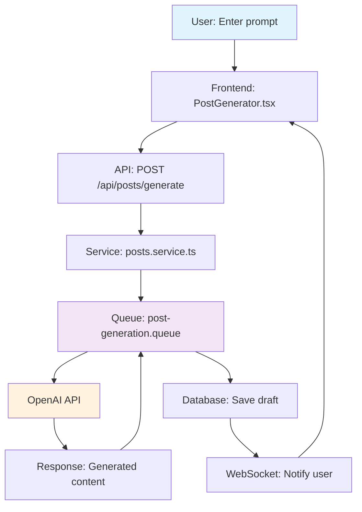

# Generate Documentation

**Purpose:** Create comprehensive technical documentation for code, APIs, and features.

## When to Use

- Documenting new features or APIs
- Creating developer guides
- Writing API specifications
- Generating code examples
- Creating onboarding documentation

## What Gets Generated

### 1. Code Documentation

```typescript
/**
 * Function/method descriptions
 * @param {Type} paramName - Parameter description
 * @returns {Type} Return value description
 * @throws {ErrorType} Error conditions
 * @example
 * // Usage example
 * const result = functionName(params);
 */
```

### 2. API Documentation

```markdown
## POST /api/endpoint

**Description:** What this endpoint does

**Authentication:** Required (ClerkAuthGuard)

**Request Body:**
{
  "field": "value",
  "organization": "org_id"  // Required for multi-tenancy
}

**Response (200):**
{
  "data": {...},
  "message": "Success"
}

**Errors:**
- 400: Bad Request - Invalid input
- 401: Unauthorized - Missing/invalid auth
- 403: Forbidden - No access to resource
- 404: Not Found - Resource doesn't exist

**Rate Limiting:** 100 requests/minute

**Example:**
curl -X POST https://api.example.com/api/endpoint \
  -H "Authorization: Bearer $TOKEN" \
  -d '{"field": "value"}'
```

### 3. Feature Documentation

```markdown
## Feature Name

**Overview:** What this feature does and why it exists

**User Journey:**
1. User action
2. System response
3. Result

**Technical Implementation:**
- Frontend: Component paths
- Backend: Controller/service paths
- Database: Collections affected
- Queue: Background jobs (if any)
- External: APIs used

**Configuration:**
Environment variables needed

**Testing:**
How to test this feature

**Known Issues:**
Current limitations or gotchas
```

## Documentation Standards

### Code Comments

```typescript
// ✅ GOOD - Self-documenting code
const activeUserPosts = posts.filter(post =>
  !post.isDeleted && post.organization === orgId
);

// ❌ BAD - Obvious comment
// Filter posts
const filtered = posts.filter(p => !p.d && p.o === id);
```

### JSDoc for Public APIs

```typescript
/**
 * Fetches user posts with organization filtering
 *
 * @param userId - User identifier
 * @param organization - Organization ID for multi-tenancy
 * @returns Promise resolving to array of posts
 * @throws {NotFoundException} When user not found
 * @throws {ForbiddenException} When user not in organization
 *
 * @example
 * const posts = await getUserPosts('user123', 'org456');
 */
async getUserPosts(userId: string, organization: string): Promise<Post[]> {
  // Implementation
}
```

### API Endpoint Documentation

Follow the pattern in `.http` files:

```http
### Get User Posts
# @name getUserPosts
GET {{baseUrl}}/api/posts/user/{{userId}}
Authorization: Bearer {{authToken}}
Organization: {{organizationId}}

###
```

## Focus Areas

### For Developers

- **Installation & Setup:** Step-by-step getting started
- **Configuration:** Environment variables and settings
- **Architecture:** High-level system design
- **Patterns:** Code patterns used (from `.agents/EXAMPLES/`)
- **Troubleshooting:** Common issues and solutions

### For API Users

- **Authentication:** How to authenticate (Clerk JWT)
- **Endpoints:** Complete API reference with examples
- **Rate Limits:** Request quotas and throttling
- **Errors:** Error codes and handling
- **Webhooks:** Real-time event notifications

### For Features

- **User Stories:** What problem this solves
- **Flow Diagrams:** Visual system interaction (Mermaid or text)
- **Dependencies:** Required services/APIs
- **Security:** Auth requirements, data isolation
- **Performance:** Expected load and optimization

## Output Locations

### Code Documentation

- **Inline:** JSDoc comments in code
- **README:** Feature overview in module folder

### API Documentation

- **Swagger:** Auto-generated from decorators
- **.http files:** Co-located with controllers
- **External:** API docs site (if exists)

### Feature Documentation

- **Session Files:** `.agents/SESSIONS/YYYY-MM-DD.md` (includes flowchart)
- **Architecture:** `.agents/SYSTEM/ARCHITECTURE.md` (major decisions)
- **SOPs:** `.agents/SOP/*.md` (patterns and procedures)

## Quality Checklist

```
- [ ] Clear and concise language
- [ ] Practical code examples included
- [ ] All parameters documented
- [ ] Error cases covered
- [ ] Security considerations noted
- [ ] Performance implications mentioned
- [ ] Links to related documentation
- [ ] Up-to-date with current implementation
```

## Examples

### Example 1: Document New API Endpoint

**Input:** "Document the POST /api/posts endpoint"

**Output:**

````markdown
## POST /api/posts

Create a new social media post.

**Authentication:** Required (ClerkAuthGuard)

**Request Body:**
```typescript
{
  content: string;        // Post text content (max 5000 chars)
  platform: 'twitter' | 'linkedin' | 'facebook';
  scheduledAt?: Date;     // Optional: Schedule for future
  aiGenerated?: boolean;  // Whether content is AI-generated
}
```

**Response (201):**
```typescript
{
  _id: string;
  content: string;
  platform: string;
  status: 'draft' | 'scheduled' | 'published';
  organization: string;
  createdAt: Date;
  updatedAt: Date;
}
```

**Errors:**
- 400: Invalid content or platform
- 401: Missing authentication token
- 403: User not authorized for organization
- 429: Rate limit exceeded (100/hour)

**Multi-Tenancy:**
Organization is automatically set from authenticated user. Post is isolated to user's organization.

**Example Request:**
```bash
curl -X POST https://api.example.com/api/posts \
  -H "Authorization: Bearer $TOKEN" \
  -H "Content-Type: application/json" \
  -d '{
    "content": "My post content",
    "platform": "twitter"
  }'
```

**Implementation:**
- Controller: `[api-project]/src/posts/posts.controller.ts`
- Service: `[api-project]/src/posts/posts.service.ts`
- Schema: `[api-project]/src/posts/schemas/post.schema.ts`
````

### Example 2: Document Feature Implementation

**Input:** "Document the AI post generation feature"

**Output:**

````markdown
## AI Post Generation

Automatically generate social media posts using AI based on user prompts.

### System Flow



### Components

**Frontend:**
- `[frontend-project]/components/PostGenerator.tsx` - User interface
- `[frontend-project]/services/posts.service.ts` - API client

**Backend:**
- `[api-project]/src/posts/posts.controller.ts` - Endpoint handler
- `[api-project]/src/posts/posts.service.ts` - Business logic
- `[api-project]/src/posts/queues/post-generation.queue.ts` - Background job

**External:**
- OpenAI GPT-4 API - Content generation

### User Journey

1. User enters prompt: "Write a tweet about productivity"
2. Frontend sends request to API with prompt
3. API validates request and queues background job
4. Returns 202 Accepted with job ID
5. Background worker calls OpenAI API
6. Generated content saved as draft post
7. WebSocket notification sent to user
8. Frontend displays generated post for review

### Configuration

```env
OPENAI_API_KEY=sk-...
OPENAI_MODEL=gpt-4
POST_GENERATION_QUEUE=post-generation
MAX_GENERATION_LENGTH=5000
```

### Security

- Requires authentication (ClerkAuthGuard)
- Rate limited: 20 generations/hour per user
- Content filtered for harmful content
- Organization isolation enforced

### Performance

- Average generation time: 2-4 seconds
- Queue handles burst traffic
- WebSocket for real-time updates
- No blocking operations in API

### Known Issues

- Long prompts (>1000 chars) may timeout
- OpenAI rate limits apply (handled with retry)
- Generated content requires human review
````

## Best Practices

### Documentation Principles

1. **Clarity Over Completeness:** Better to be clear than exhaustive
2. **Examples First:** Show, don't just tell
3. **Practical Focus:** Real-world usage over theory
4. **Maintenance:** Update docs with code changes
5. **Security:** Always document auth and data isolation
6. **Organization Filtering:** Document multi-tenancy requirements

### Writing Style

- Use active voice
- Write in second person ("You can...")
- Be concise (shorter paragraphs)
- Use code blocks for examples
- Link to related documentation
- Include version/date information

### Multi-Tenancy Documentation

ALWAYS document organization filtering:

```typescript
/**
 * IMPORTANT: Multi-tenancy enforced
 * - Automatically filters by user's organization
 * - No cross-organization data access
 * - organization field required in all queries
 */
async findUserData(userId: string, organization: string) {
  return this.model.find({
    userId,
    organization,      // ✅ Multi-tenancy
    isDeleted: false   // ✅ Soft delete
  });
}
```

---

**Created:** 2025-11-21
**Category:** Documentation
**Inspired by:** claudecodecommands.directory/Documentation Generator
