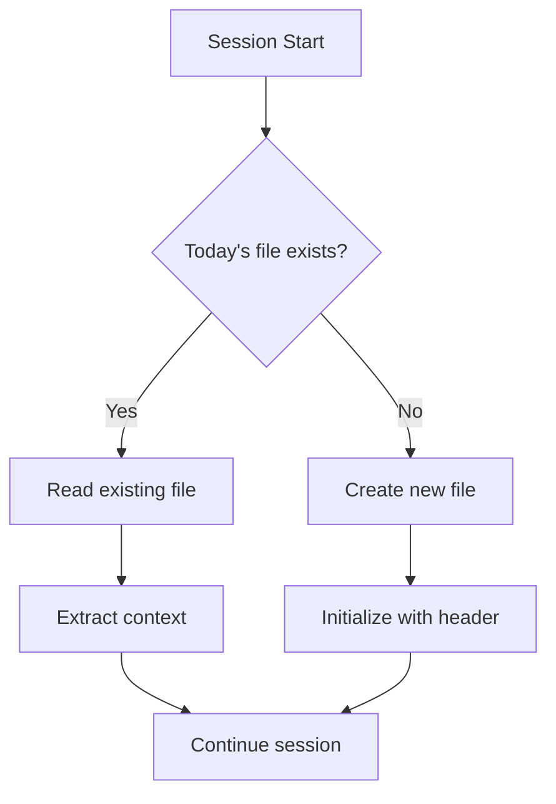
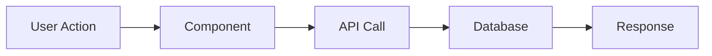
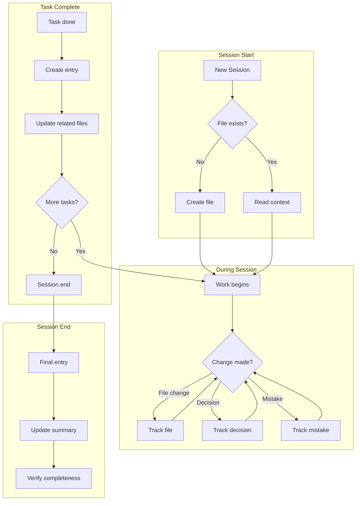
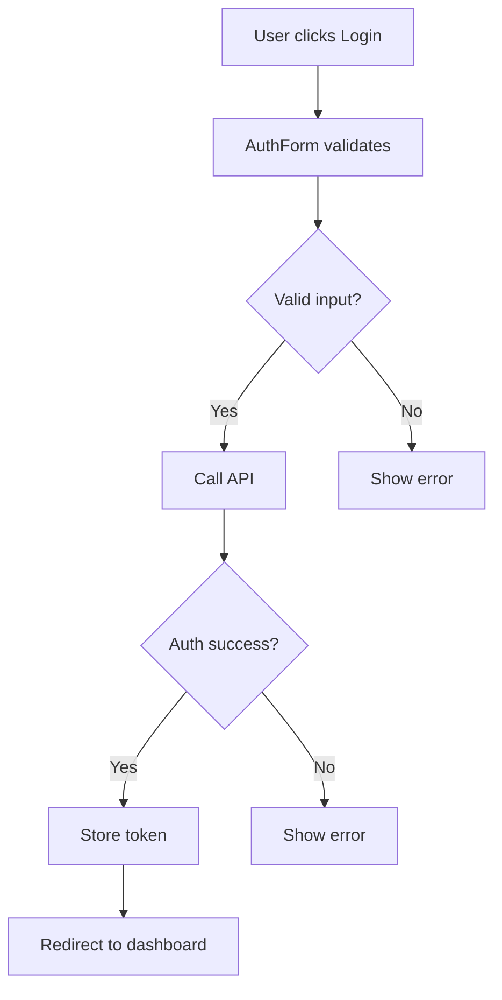
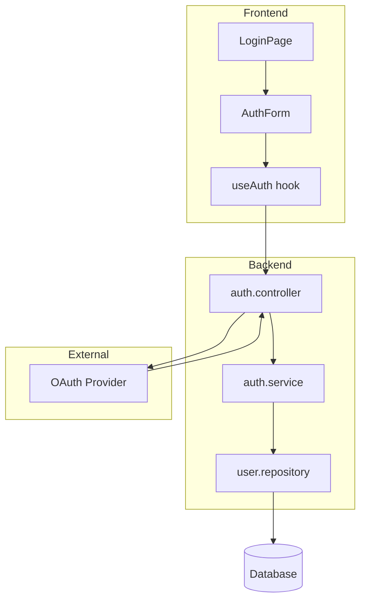

# Session Documenter - Full Guide

Automatically document all work, decisions, and context throughout the session for continuity across AI interactions.

---

## When This Skill Activates

This skill activates automatically (no manual invocation needed) when:

| Trigger | Description |
|---------|-------------|
| **Task Completion** | A task from TodoList is marked completed |
| **File Changes** | Files are modified, created, or deleted |
| **Architectural Decisions** | Design patterns or architecture choices are made |
| **New Patterns** | Reusable patterns are established |
| **Session End** | MANDATORY - must document before clearing context |
| **Mistakes Fixed** | When errors are caught and corrected |

---

## Critical Rules

### ONE FILE PER DAY Naming Convention

```
.agents/SESSIONS/YYYY-MM-DD.md
```

| Status | Example |
|--------|---------|
| CORRECT | `.agents/SESSIONS/2025-11-15.md` |
| WRONG | `.agents/SESSIONS/2025-11-15-feature-name.md` |
| WRONG | `.agents/SESSIONS/auth-implementation.md` |
| WRONG | `.agents/SESSIONS/session-1.md` |

**Multiple sessions same day** = Same file, Session 1, Session 2, etc.

### Required Protocols

1. **Check before creating** - Always check if today's file exists
2. **Append, don't overwrite** - Add new sessions to existing file
3. **Include flowcharts** - For new features or complex changes
4. **Update related files** - Keep cross-references in sync
5. **Document mistakes** - Learning from errors is valuable

### Flowchart Requirements (MANDATORY for Features)

Include a flowchart for:

- New features (any size)
- Feature modifications that change flow
- Multi-component bug fixes
- Integration changes
- Data flow modifications

---

## Phase 1: Session Start (Auto-Execute)

### Automatic Actions at Session Start



### Check for Existing Session File

```bash
# Check if today's session file exists
ls -la .agents/SESSIONS/$(date +%Y-%m-%d).md 2>/dev/null

# Alternative: Check with explicit date
ls -la .agents/SESSIONS/2025-11-15.md 2>/dev/null
```

### Create New Session File (if needed)

```bash
# Create sessions directory if missing
mkdir -p .agents/SESSIONS

# Create today's file with header
cat > .agents/SESSIONS/$(date +%Y-%m-%d).md << 'EOF'
# Sessions: YYYY-MM-DD

**Summary:** [Update after first session]

---

## Session 1: [Brief Description]

**Duration:** ~X hours
**Status:** In Progress

### System Flow

[Add flowchart here]

### What was done

- [ ] Task 1
- [ ] Task 2

### Files changed

- `path/to/file.ts` - what changed

### Decisions

- **Decision:** [What was decided]
  - **Context:** [Why this was needed]
  - **Rationale:** [Why this choice]

### Mistakes and fixes

_None yet_

### Next steps

- [ ] Next task 1

---

**Total sessions today:** 1
EOF
```

### Read Existing Session for Context

```bash
# Read today's session file
cat .agents/SESSIONS/$(date +%Y-%m-%d).md

# Read last N lines for quick context
tail -50 .agents/SESSIONS/$(date +%Y-%m-%d).md
```

---

## Phase 2: During Session (Auto-Track)

### What to Track in Real-Time

| Category | What to Capture | Priority |
|----------|-----------------|----------|
| **Decisions** | Architecture choices, library selections, pattern choices | HIGH |
| **File Changes** | Every file modified/created/deleted with reason | HIGH |
| **Patterns Used** | Reusable patterns established or followed | MEDIUM |
| **Mistakes** | Errors made and how they were fixed | HIGH |
| **Dependencies** | New packages added, version changes | MEDIUM |
| **Context** | Why something was done, not just what | HIGH |

### Memory Tracking Format

Track these in working memory during the session:

```markdown
## Working Memory (Internal)

### Decisions Made
1. Chose X over Y because [reason]
2. Used pattern Z from [reference]

### Files Changed
- `src/components/Auth.tsx` - Added OAuth flow
- `src/lib/api.ts` - New API client methods

### Patterns Established
- Error handling pattern: try/catch with toast notifications
- API calls: use `useQuery` with specific cache settings

### Mistakes Log
1. Forgot to add null check → Fixed by adding optional chaining
2. Wrong import path → Fixed by using absolute imports
```

### Auto-Track Triggers

The skill should automatically capture:

```
ON file_save:
  → Record: filename, change summary

ON decision_made:
  → Record: decision, context, rationale

ON error_fixed:
  → Record: mistake, fix, prevention

ON pattern_used:
  → Record: pattern name, where applied
```

---

## Phase 3: After Task Completion

### Session Entry Creation

After completing a task or set of tasks, create a session entry:

```markdown
## Session N: [Brief Description - 3-5 words]

**Duration:** ~X hours
**Status:** Complete

### System Flow



### Affected Components

| Layer | Components |
|-------|------------|
| Frontend | `AuthForm.tsx`, `LoginPage.tsx` |
| Backend | `auth.controller.ts`, `auth.service.ts` |
| Data | `users` collection, `sessions` collection |
| External | OAuth provider, Email service |

### What was done

- [x] Implemented OAuth login flow
- [x] Added session management
- [x] Created user profile page
- [x] Added logout functionality

### Files changed

- `src/components/AuthForm.tsx` - New component for auth UI
- `src/pages/login.tsx` - Login page implementation
- `src/lib/auth.ts` - Auth utilities and hooks
- `src/api/auth.controller.ts` - Backend auth endpoints

### Key decisions

- **Decision:** Use JWT for session tokens
  - **Context:** Need stateless authentication for scalability
  - **Rationale:** JWT allows horizontal scaling without shared session store

- **Decision:** Store refresh tokens in httpOnly cookies
  - **Context:** Security requirement for token storage
  - **Rationale:** Prevents XSS attacks from accessing tokens

### Mistakes and fixes

- **Mistake:** Initially stored tokens in localStorage
- **Fix:** Moved to httpOnly cookies
- **Prevention:** Always use secure storage for sensitive tokens

### Next steps

- [ ] Add password reset flow
- [ ] Implement MFA support
- [ ] Add social login providers

```

### Update Related Files

After documenting the session, update these files:

```bash
# 1. Update SESSIONS/README.md with link to today
echo "- [$(date +%Y-%m-%d)]($(date +%Y-%m-%d).md) - Brief description" >> .agents/SESSIONS/README.md

# 2. Update SYSTEM/SUMMARY.md if major changes
# Add to Recent Changes section

# 3. Update TASKS if task tracking
# Mark completed tasks, add new ones

# 4. Update ARCHITECTURE.md if architectural decisions
# Add to Decisions section
```

---

## Automation Flow



### Text-Based Flow Alternative

```
SESSION START
    │
    ├─► Check: .agents/SESSIONS/YYYY-MM-DD.md exists?
    │   ├─► NO  → Create new file with template
    │   └─► YES → Read file for context
    │
DURING SESSION
    │
    ├─► On file change → Record to working memory
    ├─► On decision → Record with context + rationale
    ├─► On mistake → Record mistake + fix + prevention
    ├─► On pattern → Record for future reference
    │
TASK COMPLETION
    │
    ├─► Write session entry to file
    ├─► Update: SESSIONS/README.md
    ├─► Update: SYSTEM/SUMMARY.md (if major)
    ├─► Update: TASKS/TODO.md (if tracked)
    └─► Update: ARCHITECTURE.md (if decisions)
    │
SESSION END
    │
    ├─► Finalize session entry
    ├─► Update file summary
    └─► Increment session count
```

---

## User-Facing Messages

### Session Start Messages

```markdown
## Starting new session

📄 Session file: `.agents/SESSIONS/2025-11-15.md`
📋 Context loaded: 2 previous sessions today
🎯 Ready to document this session's work
```

```markdown
## Continuing existing session

📄 Reading: `.agents/SESSIONS/2025-11-15.md`
📊 Previous sessions: 1
🔄 Status: Session 2 will be appended
```

### During Session Messages

```markdown
## Tracking changes

📝 Recorded: `src/components/Button.tsx` - Added loading state
📝 Recorded: Decision - Use CSS modules over styled-components
```

### Task Completion Messages

```markdown
## Session entry created

✅ Added Session 2 entry to `.agents/SESSIONS/2025-11-15.md`
📊 Files tracked: 5
💡 Decisions documented: 2
🔧 Mistakes logged: 1
```

### Session End Messages

```markdown
## Session documented

📄 Updated: `.agents/SESSIONS/2025-11-15.md`
📋 Sessions today: 2
📊 Total changes: 8 files

### Summary
- Implemented user authentication
- Added OAuth integration
- Created profile page
```

---

## Validation Rules

### Required Fields Check

Every session entry MUST have:

| Field | Required | Validation |
|-------|----------|------------|
| Session number | YES | Sequential integer |
| Brief description | YES | 3-10 words |
| Duration | YES | Format: `~X hours` or `~X minutes` |
| Status | YES | `Complete` or `In Progress` |
| What was done | YES | At least 1 item |
| Files changed | YES | At least 1 file |
| Decisions | NO | Recommended if any made |
| Mistakes | NO | Document if any occurred |
| Next steps | YES | At least 1 item or "None" |

### Auto-Fix Violations

```bash
# Check for missing session file
if [ ! -f ".agents/SESSIONS/$(date +%Y-%m-%d).md" ]; then
    echo "ERROR: No session file for today"
    echo "ACTION: Creating session file..."
    # Create file with template
fi

# Check for missing required sections
grep -q "### What was done" ".agents/SESSIONS/$(date +%Y-%m-%d).md"
if [ $? -ne 0 ]; then
    echo "ERROR: Missing 'What was done' section"
    echo "ACTION: Adding section..."
fi

# Check for proper session numbering
SESSION_COUNT=$(grep -c "^## Session " ".agents/SESSIONS/$(date +%Y-%m-%d).md")
echo "Session count: $SESSION_COUNT"
```

### Common Violations and Fixes

| Violation | Auto-Fix |
|-----------|----------|
| Wrong file name | Rename to `YYYY-MM-DD.md` format |
| Missing flowchart (feature) | Add placeholder with TODO |
| Empty "What was done" | Prompt for at least one item |
| No files changed | Flag as suspicious, confirm |
| Missing Next steps | Add "Continue implementation" default |

---

## Inline Commands Reference

### Session Management Commands

```bash
# Create today's session file
mkdir -p .agents/SESSIONS && touch .agents/SESSIONS/$(date +%Y-%m-%d).md

# List all session files
ls -la .agents/SESSIONS/*.md

# Find sessions from this week
find .agents/SESSIONS -name "*.md" -mtime -7

# Count sessions in current file
grep -c "^## Session " .agents/SESSIONS/$(date +%Y-%m-%d).md

# Get last session number
grep "^## Session " .agents/SESSIONS/$(date +%Y-%m-%d).md | tail -1

# Check if session file exists
test -f .agents/SESSIONS/$(date +%Y-%m-%d).md && echo "exists" || echo "missing"
```

### Content Extraction Commands

```bash
# Extract all decisions from today's session
grep -A 3 "^\*\*Decision:" .agents/SESSIONS/$(date +%Y-%m-%d).md

# Extract all files changed
grep "^- \`" .agents/SESSIONS/$(date +%Y-%m-%d).md

# Extract next steps
grep -A 10 "### Next steps" .agents/SESSIONS/$(date +%Y-%m-%d).md

# Get session summaries
grep "^## Session" .agents/SESSIONS/$(date +%Y-%m-%d).md
```

### Archive Commands

```bash
# Archive sessions older than 3 months
mkdir -p .agents/SESSIONS/archive
find .agents/SESSIONS -maxdepth 1 -name "*.md" -mtime +90 -exec mv {} .agents/SESSIONS/archive/ \;

# List archived sessions
ls .agents/SESSIONS/archive/

# Search across all sessions (including archive)
grep -r "pattern" .agents/SESSIONS/
```

---

## Flowchart Generation Guide

### When to Include Flowcharts

| Scenario | Flowchart Required | Type |
|----------|-------------------|------|
| New feature | YES | System flow |
| Bug fix (single file) | NO | - |
| Bug fix (multi-file) | YES | Data flow |
| Refactoring | OPTIONAL | Before/After |
| API changes | YES | Request flow |
| Database changes | YES | Data model |
| Integration | YES | Integration flow |

### Mermaid Format (Preferred)

```markdown
### System Flow



```

### Text Flow Alternative

When mermaid is not supported:

```markdown
### System Flow

```

User Action
    │
    ▼
┌─────────────┐
│  Component  │
└─────────────┘
    │
    ▼
┌─────────────┐     ┌─────────────┐
│  API Call   │────►│  Database   │
└─────────────┘     └─────────────┘
    │
    ▼
┌─────────────┐
│  Response   │
└─────────────┘

```
```

### Detailed List Alternative

For complex flows:

```markdown
### System Flow

1. **User Action**
   - User clicks "Login" button
   - Form data collected

2. **Frontend Validation**
   - Email format check
   - Password length check
   - If invalid → Show inline errors

3. **API Request**
   - POST `/api/auth/login`
   - Body: `{ email, password }`
   - Headers: `Content-Type: application/json`

4. **Backend Processing**
   - Validate credentials
   - Generate JWT token
   - Create session record

5. **Response Handling**
   - Success → Store token, redirect
   - Failure → Display error message
```

---

## Memory Tracking During Session

### Internal Tracking Structure

Maintain this structure in working memory:

```markdown
## Session Memory (Do Not Output)

### Current Session: 3
### Start Time: 14:30

### Tracked Changes
| Time | Type | Item | Details |
|------|------|------|---------|
| 14:32 | FILE | Button.tsx | Added loading prop |
| 14:45 | DECISION | State mgmt | Chose Zustand |
| 14:50 | MISTAKE | Import | Wrong path, fixed |
| 15:10 | FILE | api.ts | New fetch util |

### Pending Documentation
- [ ] Button component changes
- [ ] State management decision rationale
- [ ] API utility documentation

### Quick Context
- Working on: User authentication
- Blocked by: Nothing
- Next: Implement login form
```

### When to Persist Memory

Write to session file when:

1. **Task completed** - Full entry with all tracked items
2. **Major milestone** - Checkpoint documentation
3. **Before context clear** - MANDATORY full dump
4. **Complex decision made** - Immediate documentation
5. **Significant mistake** - Document while fresh

---

## Full Example Session Entry

```markdown
# Sessions: 2025-11-15

**Summary:** User authentication, OAuth, profile page

---

## Session 1: Initial Auth Setup

**Duration:** ~2 hours
**Status:** Complete

### System Flow



### Affected Components

| Layer | Components | Changes |
|-------|------------|---------|
| Frontend | `LoginPage`, `AuthForm`, `useAuth` | New components |
| Backend | `auth.controller`, `auth.service` | New endpoints |
| Data | `users`, `sessions` collections | Schema updates |
| External | Google OAuth | Integration |

### What was done

- [x] Created login page with email/password form
- [x] Implemented OAuth flow with Google
- [x] Added JWT token management
- [x] Created auth middleware for protected routes
- [x] Built user profile page

### Files changed

- `src/pages/login.tsx` - New login page component
- `src/components/AuthForm.tsx` - Reusable auth form
- `src/hooks/useAuth.ts` - Auth state management hook
- `src/lib/auth.ts` - Auth utility functions
- `src/api/auth.controller.ts` - Auth API endpoints
- `src/api/auth.service.ts` - Auth business logic
- `src/middleware/auth.middleware.ts` - JWT verification
- `src/pages/profile.tsx` - User profile page

### Key decisions

- **Decision:** JWT over session-based auth
  - **Context:** Need stateless auth for microservices architecture
  - **Rationale:** Enables horizontal scaling, works with API-first design

- **Decision:** Refresh tokens in httpOnly cookies
  - **Context:** Security requirement for token storage
  - **Rationale:** Prevents XSS from accessing tokens, CSRF mitigated by SameSite

- **Decision:** Zustand for auth state
  - **Context:** Need lightweight state management
  - **Rationale:** Simpler than Redux, built-in persistence

### Patterns established

- **Auth hook pattern**: `useAuth()` returns `{ user, login, logout, isLoading }`
- **Protected route pattern**: HOC that checks auth and redirects
- **API error handling**: Consistent error response format

### Mistakes and fixes

- **Mistake:** Initially stored JWT in localStorage
  - **Fix:** Moved to httpOnly cookie with refresh token rotation
  - **Prevention:** Always use secure storage for tokens, reference OWASP guidelines

- **Mistake:** Forgot to handle token expiration
  - **Fix:** Added refresh token flow with automatic retry
  - **Prevention:** Add token refresh to auth checklist

### Testing notes

- Manual testing: Login flow, OAuth redirect, token refresh
- Edge cases tested: Expired token, invalid credentials, network error
- Not tested: Rate limiting (TODO)

### Next steps

- [ ] Implement password reset flow
- [ ] Add rate limiting to auth endpoints
- [ ] Set up MFA (TOTP)
- [ ] Add social login (GitHub, Discord)
- [ ] Write unit tests for auth service

---

## Session 2: Password Reset

**Duration:** ~1 hour
**Status:** In Progress

### What was done

- [x] Created password reset request endpoint
- [x] Built email template for reset link
- [ ] Implement reset confirmation page

### Files changed

- `src/api/auth.controller.ts` - Added reset endpoints
- `src/emails/password-reset.tsx` - Email template

### Next steps

- [ ] Complete reset confirmation page
- [ ] Add rate limiting to reset endpoint
- [ ] Test email delivery

---

**Total sessions today:** 2

```

---

## Checklists

### Session Start Checklist

```markdown
- [ ] Check if `.agents/SESSIONS/YYYY-MM-DD.md` exists
- [ ] If exists: Read for context, note last session number
- [ ] If missing: Create with template header
- [ ] Review previous session's "Next steps"
- [ ] Note any incomplete tasks from previous session
- [ ] Initialize working memory for tracking
```

### During Session Checklist

```markdown
- [ ] Track every file changed (path + what changed)
- [ ] Document decisions immediately (decision + context + rationale)
- [ ] Log mistakes as they happen (mistake + fix + prevention)
- [ ] Note patterns being established or followed
- [ ] Keep running list of "next steps" as they emerge
- [ ] Flag anything that needs flowchart documentation
```

### After Task Completion Checklist

```markdown
- [ ] Create session entry with all required fields
- [ ] Include flowchart for new features/complex changes
- [ ] List all affected components by layer
- [ ] Document all files changed with summaries
- [ ] Record all decisions with full rationale
- [ ] Document any mistakes and lessons learned
- [ ] Define clear next steps
- [ ] Update related files (README, SUMMARY, etc.)
```

### Session End Checklist

```markdown
- [ ] Ensure current session entry is complete
- [ ] Update session status to "Complete" or note "In Progress"
- [ ] Verify "Next steps" are actionable
- [ ] Update file header summary
- [ ] Increment total sessions count
- [ ] Cross-reference: Update SESSIONS/README.md
- [ ] If architectural changes: Update ARCHITECTURE.md
- [ ] If major changes: Update SYSTEM/SUMMARY.md
- [ ] Final validation: All required fields present
```

---

## Quick Reference Card

### File Naming

```
.agents/SESSIONS/YYYY-MM-DD.md
```

### Session Entry Template

```markdown
## Session N: Brief Description

**Duration:** ~X hours
**Status:** Complete/In Progress

### System Flow
[mermaid or text diagram]

### What was done
- [x] Task 1
- [x] Task 2

### Files changed
- `path/file.ts` - what changed

### Decisions
- **Decision:** What
  - **Context:** Why needed
  - **Rationale:** Why this choice

### Mistakes and fixes
- **Mistake:** What happened
- **Fix:** How resolved
- **Prevention:** How to avoid

### Next steps
- [ ] Next task
```

### Key Commands

```bash
# Today's file path
.agents/SESSIONS/$(date +%Y-%m-%d).md

# Check if exists
test -f .agents/SESSIONS/$(date +%Y-%m-%d).md

# Session count
grep -c "^## Session " .agents/SESSIONS/$(date +%Y-%m-%d).md
```

---

**Questions?** This guide covers the complete session documentation workflow. For project-specific customizations, check `.agents/SYSTEM/RULES.md`.
