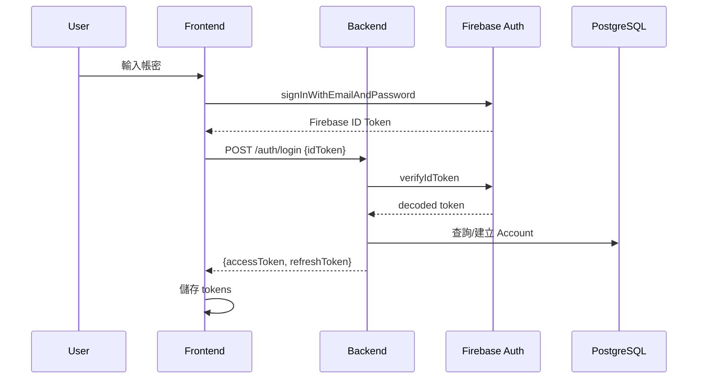
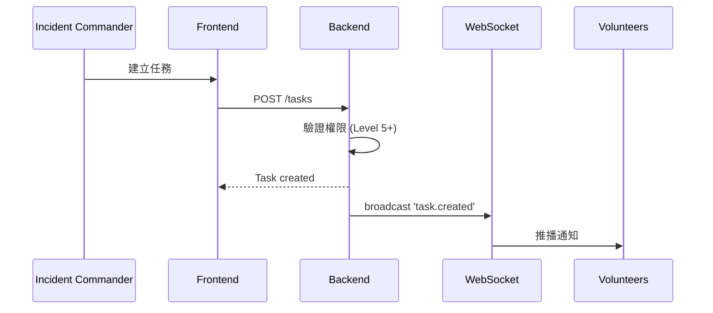
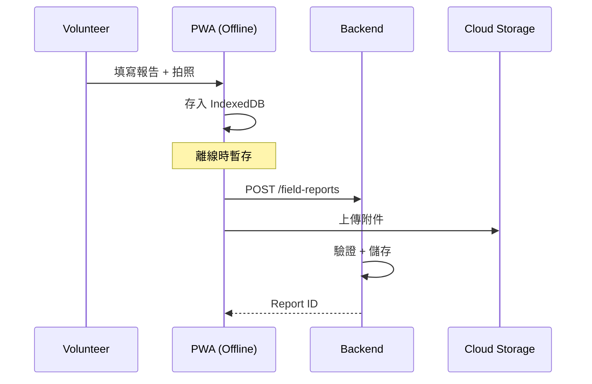
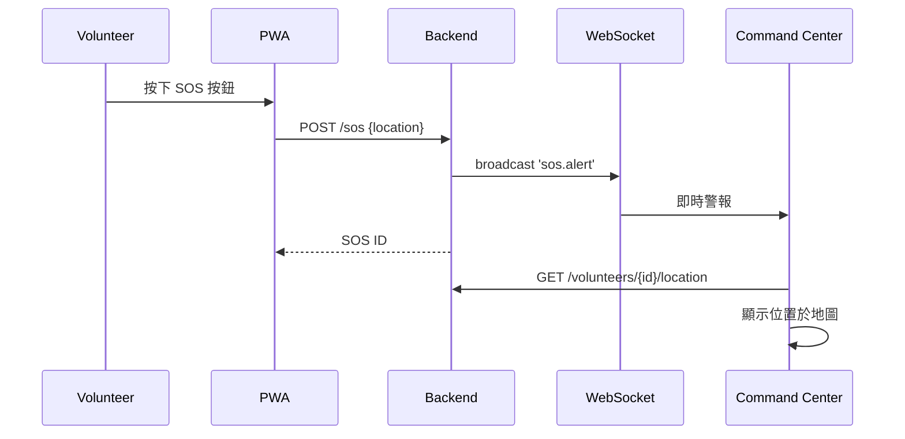
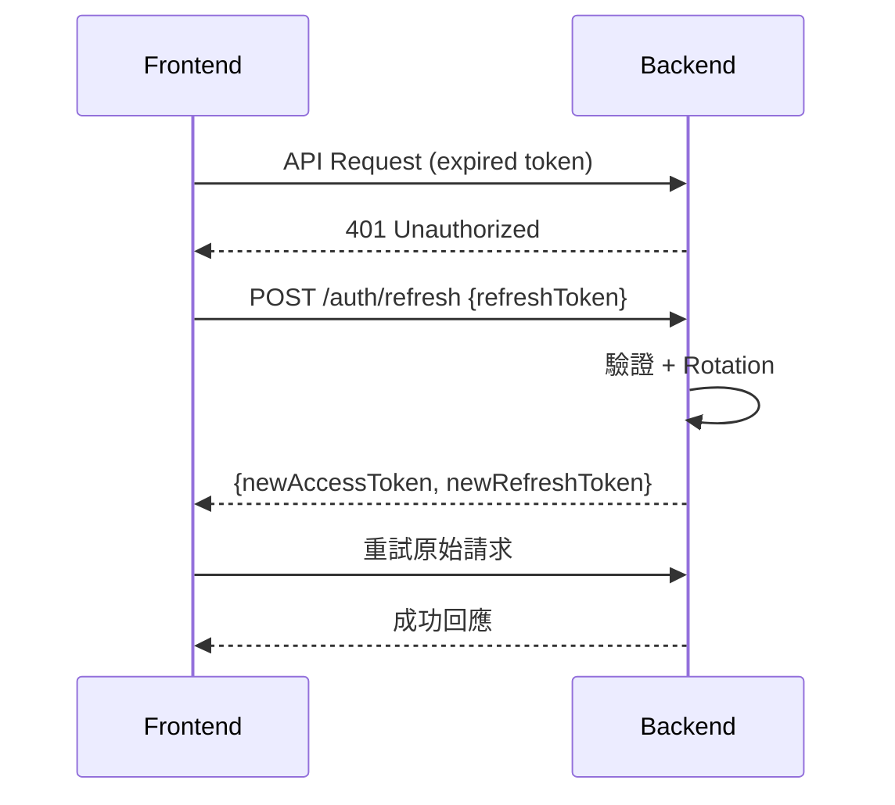
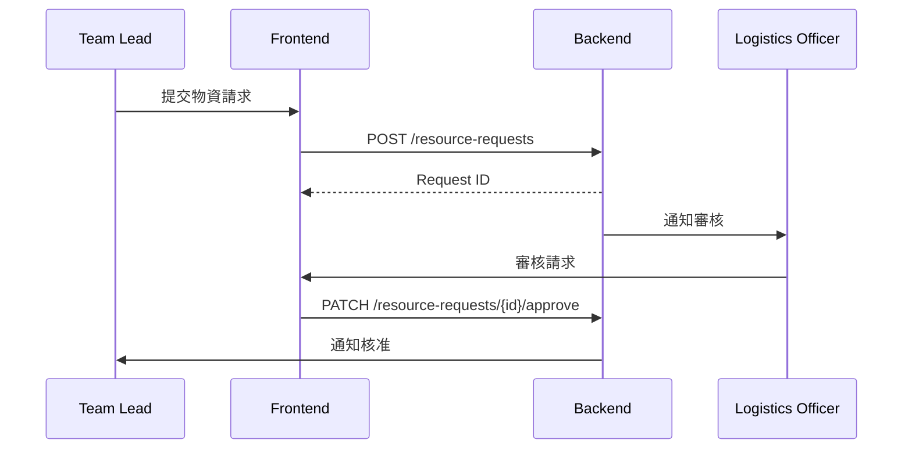

# 📋 Light Keepers E2E 流程文件

## Flow 1: 用戶登入流程

**SLO**: 登入完成 < 2s (P95)

---

## Flow 2: 任務發布流程

**SLO**: 任務發布到推播 < 500ms

---

## Flow 3: 現場報告提交

**SLO**: 報告上傳 < 5s (含附件)

---

## Flow 4: 緊急求救 (SOS)

**SLO**: SOS 到指揮中心 < 1s

---

## Flow 5: Token 自動續期

**SLO**: Token 續期 < 200ms

---

## Flow 6: 物資請求流程

**SLO**: 請求到通知 < 3s
