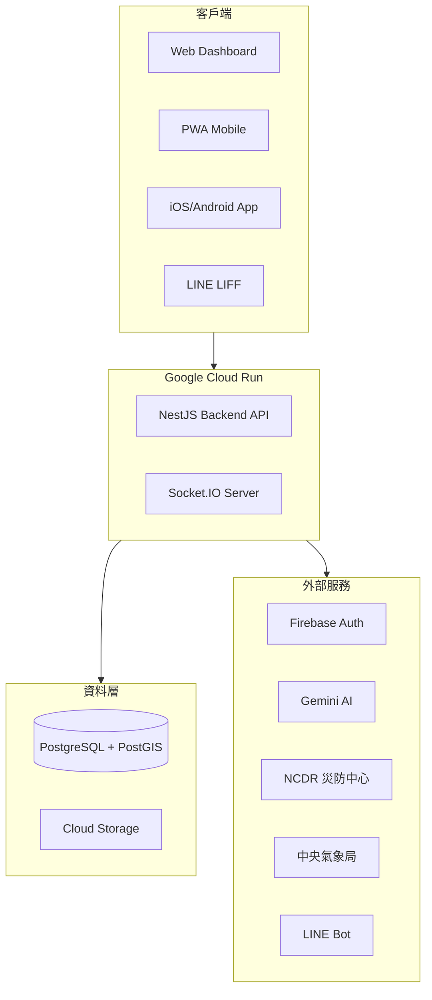

# 光守護者災防平台 - 技術規格文件

> **版本**：2.0  
> **更新日期**：2026-01-06  
> **文件類型**：技術規格書

---

## 一、系統概述

光守護者災防平台 (Light Keepers) 是一套完整的災難應變與志工管理系統，整合 ICS (事件指揮系統) 標準與 AI 智慧決策，提供從日常管理到緊急應變的全方位解決方案。

---

## 二、系統架構

---

## 三、後端技術堆疊

### 3.1 核心框架
| 技術 | 版本 | 說明 |
|------|:----:|------|
| NestJS | 10.3 | 企業級 Node.js 框架 |
| TypeScript | 5.3 | 強型別程式語言 |
| TypeORM | 0.3.19 | ORM 框架 |
| PostgreSQL | 15+ | 關聯式資料庫 |
| PostGIS | 3.x | 地理空間擴充 |

### 3.2 認證與安全
| 技術 | 版本 | 說明 |
|------|:----:|------|
| Firebase Admin | 13.6 | 身份驗證後端 |
| Passport JWT | 4.0 | JWT 策略 |
| Helmet | 8.1 | HTTP 安全標頭 |
| @nestjs/throttler | 6.5 | API 限流 |

### 3.3 通訊與即時
| 技術 | 版本 | 說明 |
|------|:----:|------|
| Socket.IO | 4.8 | WebSocket 雙向通訊 |
| MQTT | 5.14 | LoRa Mesh 離線通訊 |
| Nodemailer | 7.0 | Email 發送 |
| Resend | 6.6 | 交易型 Email |

### 3.4 AI 與外部整合
| 技術 | 版本 | 說明 |
|------|:----:|------|
| Google Generative AI | 0.24 | Gemini API |
| LINE Bot SDK | 10.5 | LINE 機器人 |
| Google Cloud Storage | 7.18 | 檔案儲存 |
| Axios | 1.13 | HTTP 客戶端 |

---

## 四、前端技術堆疊

### 4.1 核心框架
| 技術 | 版本 | 說明 |
|------|:----:|------|
| React | 19.2 | UI 框架 |
| Vite | 7.2 | 建構工具 |
| TypeScript | 5.9 | 型別系統 |
| React Router | 7.11 | SPA 路由 |

### 4.2 狀態與資料
| 技術 | 版本 | 說明 |
|------|:----:|------|
| TanStack Query | 5.90 | 伺服器狀態管理 |
| Socket.IO Client | 4.8 | 即時資料同步 |
| Firebase | 12.7 | 認證 SDK |

### 4.3 地圖與視覺化
| 技術 | 版本 | 說明 |
|------|:----:|------|
| Leaflet | 1.9 | 互動地圖 |
| React-Leaflet | 5.0 | React 封裝 |
| MapLibre GL | 5.15 | 向量地圖 |
| PMTiles | 4.3 | 離線圖磚 |
| Chart.js | 4.5 | 資料圖表 |

### 4.4 行動與離線
| 技術 | 版本 | 說明 |
|------|:----:|------|
| Capacitor | 8.0 | 原生 APP 封裝 |
| Vite PWA Plugin | 1.2 | Service Worker |
| LINE LIFF | 2.27 | LINE 內嵌應用 |
| IndexedDB | - | 離線資料儲存 |

---

## 五、後端模組清單 (52 個)

### 5.1 核心基礎設施
- `auth` - 認證授權
- `accounts` - 帳號管理
- `tenants` - 多租戶
- `cache` - 快取管理
- `database` - 資料庫連線
- `health` - 健康檢查
- `metrics` - 效能指標
- `error-tracking` - 錯誤追蹤

### 5.2 指揮控制系統 (ICS/C2)
- `mission-sessions` - 任務場次
- `field-reports` - 現場回報
- `task-dispatch` - 任務派遣
- `tasks` - 任務管理
- `overlays` - 地圖圖層
- `location` - 位置追蹤

### 5.3 AI 智慧服務
- `ai-queue` - AI 任務佇列
- `psychological-support` - 心理支援
- `drill-simulation` - 數位孿生演練
- `integrity-ledger` - 區塊鏈完整性
- `offline-mesh` - LoRa 網狀離線

### 5.4 志工管理系統 (VMS)
- `volunteers` - 志工資料
- `training` - 教育訓練
- `activities` - 活動管理
- `community` - 社群互動

### 5.5 物資管理系統 (RMS)
- `resources` - 物資管理
- `donations` - 捐款管理
- `public-resources` - 公開查詢

### 5.6 數據分析
- `analytics` - 統計分析
- `reports` - 回報管理
- `reports-export` - 報表匯出
- `audit` - 稽核紀錄
- `access-log` - 存取日誌

### 5.7 通知與整合
- `notifications` - 多通道通知
- `line-bot` - LINE Bot
- `ncdr-alerts` - NCDR 災防告警
- `weather-forecast` - 氣象預報
- `webhooks` - Webhook 管理

---

## 六、前端頁面清單 (76+ 頁)

### 6.1 指揮控制
| 頁面 | 路由 | 權限 |
|------|------|:----:|
| EmergencyResponsePage | `/emergency-response` | L2 |
| MissionCommandPage | `/mission-command/:id` | L2 |
| CommandPostMapPage | `/emergency-response/map/:id` | L2 |
| IAPManagerPage | `/emergency-response/iap/:id` | L2 |
| SITREPViewerPage | `/emergency-response/sitrep/:id` | L2 |
| AARPlaybackPage | `/emergency-response/aar/:id` | L2 |

### 6.2 儀表板與監控
| 頁面 | 路由 | 權限 |
|------|------|:----:|
| DashboardPage | `/dashboard` | L0 |
| AnalyticsPage | `/analytics` | L3 |
| MapPage | `/map` | L0 |
| ForecastPage | `/forecast` | L0 |

### 6.3 志工與資源
| 頁面 | 路由 | 權限 |
|------|------|:----:|
| VolunteersPage | `/volunteers` | L2 |
| TrainingPage | `/training` | L1 |
| ResourcesPage | `/resources` | L2 |
| TasksPage | `/tasks` | L2 |

---

## 七、部署架構

### 7.1 雲端平台
| 服務 | 平台 | 說明 |
|------|------|------|
| 後端 API | Google Cloud Run | 容器化部署 |
| 資料庫 | Google Cloud SQL | PostgreSQL 託管 |
| 檔案 | Google Cloud Storage | 物件儲存 |
| 前端 | Firebase Hosting | 靜態網站 |
| 認證 | Firebase Auth | 身份驗證 |

### 7.2 CI/CD
- **Source**: GitHub
- **Build**: GitHub Actions
- **Deploy**: 自動部署至 Cloud Run / Firebase

---

## 八、資料實體

### 8.1 核心實體
- Account, Role, Permission
- MissionSession, MissionEvent
- Task, TaskClaim, TaskProgressUpdate
- FieldReport, ReportAttachment

### 8.2 ICS/C2 實體 (新增)
- OperationalPeriod, IAPDocument
- SITREP, DecisionLog
- AfterActionReview
- Sector, RallyPoint, PlannedRoute

### 8.3 VMS 實體
- Volunteer, VolunteerSkill, VolunteerTraining
- Activity, ActivityParticipation

### 8.4 RMS 實體
- Resource, ResourceLocation, ResourceDispatch
- Donation, DonationItem

---

## 九、統計摘要

| 項目 | 數量 |
|------|:----:|
| 後端模組 | 52 |
| 前端頁面 | 76+ |
| 資料實體 | 80+ |
| API 端點 | 200+ |
| 後端套件 | 46 |
| 前端套件 | 35 |

---

## 十、版本歷程

| 版本 | 日期 | 說明 |
|------|------|------|
| 1.0 | 2025-12 | 初版發布 |
| 2.0 | 2026-01 | ICS/C2 完整實作 |

---

*文件產生日期：2026-01-06*
