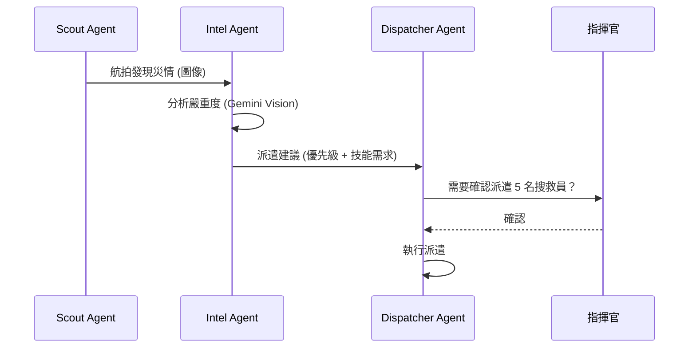

# Light Keepers 企業級架構審查報告

> **審查角色**: 國際 NGO 與大型救難組織資訊系統架構設計師  
> **審查日期**: 2026-02-01  
> **系統版本**: v40.6  
> **模組總數**: 175

---

## Executive Summary

Light Keepers 是一個**高度成熟的災難應變平台**，具備 175 個模組、9 大戰略領域、完整的 RBAC 權限體系和 Default-Deny 安全架構。

然而，從**國際 NGO 與 Mission-Critical 系統**的角度審視，仍有以下關鍵優化空間：

| 優先級 | 類別 | 項目數 |
|:------:|------|:------:|
| 🔴 P0 | 關鍵改進 | 8 |
| 🟡 P1 | 建議優化 | 12 |
| 🟢 P2 | 建議合併 | 15 |
| ⚪ P3 | 建議刪除 | 6 |
| 🔵 P4 | 建議擴充 | 10 |

---

## 🔴 P0 關鍵改進（必須處理）

### 1. 缺乏 OCHA/IASC 標準互通性

> **問題**: 未見與聯合國 OCHA 人道主義數據交換標準 (HXL, IATI) 的整合

**建議**:
```
新增模組: humanitarian-data-exchange
├── hxl-export.service.ts      # HXL 標準資料匯出
├── iati-reporting.service.ts   # IATI 財務透明報告
├── 3w-matrix.service.ts        # Who-What-Where 矩陣
└── hdx-sync.service.ts         # 與 HDX 平台同步
```

**國際標準**:
- [HXL (Humanitarian Exchange Language)](https://hxlstandard.org/)
- [IATI (International Aid Transparency Initiative)](https://iatistandard.org/)
- [OCHA 3W Matrix](https://www.humanitarianresponse.info/)

---

### 2. 多語系現場操作不足

> **問題**: `i18n-api` 模組僅 149 行，未見現場 Audio-Visual 多語支援

**建議**:
```
擴充: i18n-api → i18n-field-ops
新增功能:
├── 現場圖卡產生器 (universal pictogram generator)
├── 多語音訊播報 (emergency audio broadcast)
├── 難民語言偵測 (language detection from speech)
└── 翻譯志工協調 (translation volunteer coordination)
```

---

### 3. 缺乏標準 ICS/NIMS 整合

> **問題**: 任務指揮模組未完整對應 Incident Command System (ICS) 標準

**建議**:
```
修改: mission-sessions, task-dispatch
新增:
├── ics-forms/                  # ICS-201, 202, 214 表單
├── nims-compliant-structure/   # NIMS 標準組織架構
└── multi-agency-coordination/  # 跨機關協調 (EOC MAC)
```

**參考標準**:
- FEMA ICS Forms (ICS-201 ~ ICS-221)
- NIMS (National Incident Management System)

---

### 4. 離線優先架構不完整

> **問題**: 有 `offline-sync`, `offline-mesh`, `offline-tiles`，但缺乏統一離線策略

**建議**:
```
新增: offline-core (管理模組)
├── conflict-resolution.service.ts  # 離線衝突解決策略
├── priority-sync.service.ts        # 優先同步佇列
├── offline-auth.service.ts         # 離線認證 (cached token)
└── mesh-node-discovery.service.ts  # 網狀節點自動發現
```

**關鍵**: 災區常見 72 小時以上無網路，需完整離線運作能力

---

### 5. 缺乏 GDPR 之外的國際隱私合規

> **問題**: `gdpr-compliance` 僅處理 GDPR，未見亞太地區法規

**建議**:
```
擴充: gdpr-compliance → privacy-compliance
新增:
├── taiwan-pdpa.service.ts    # 台灣個資法
├── china-pipl.service.ts     # 中國 PIPL
├── japan-appi.service.ts     # 日本 APPI
└── consent-geo-router.ts     # 依地區自動適用法規
```

---

### 6. API 版本管理不明確

> **問題**: 所有端點使用 `/api/v1/`，未見版本演進策略

**建議**:
```
新增: api-versioning 策略
├── Header-based versioning (Accept-Version: v2)
├── Deprecation warning headers
├── Version sunset policy (12 months)
└── Migration guide automation
```

---

### 7. 缺乏 SLA/SLO 監控

> **問題**: 有 `prometheus`, `metrics`，但未見 SLA 儀表板

**建議**:
```
新增: sla-monitoring
├── uptime-tracker.service.ts     # 99.9% SLA 追蹤
├── mttr-calculator.service.ts    # 平均修復時間
├── incident-sla.service.ts       # 事件回應 SLA
└── external-dependency-sla.ts    # 外部 API 健康度
```

---

### 8. 災難復原計畫 (DRP) 自動化不足

> **問題**: `backup` 模組存在，但未見 RTO/RPO 定義與自動切換

**建議**:
```
擴充: backup → disaster-recovery
新增:
├── rto-rpo-config.yaml          # 恢復目標設定
├── automated-failover.service   # 自動故障轉移
├── geo-redundancy.service       # 跨區域備援
└── dr-drill-scheduler.service   # 定期演練排程
```

---

## 🟡 P1 建議優化

### 1. 模組命名不一致

| 現有 | 問題 | 建議 |
|------|------|------|
| `notifications` vs `notification` | 重複 | 合併為 `notifications` |
| `reports` vs `field-reports` | 混淆 | 重命名 `field-reports` → `incident-reports` |
| `cache` vs `redis-cache` | 重複 | 合併為 `cache` |
| `file-upload` vs `uploads` vs `files` | 三重 | 合併為 `files` |

---

### 2. AI 模組碎片化

| 現有 | 建議 |
|------|------|
| `ai`, `ai-prediction`, `ai-queue`, `ai-vision` | 合併為 `ai-core` + 子模組 |
| `image-recognition`, `document-ocr` | 合併為 `ai-vision` |
| `speech-to-text`, `voice-assistant` | 合併為 `ai-voice` |
| `chatbot-assistant`, `rag-knowledge` | 合併為 `ai-assistant` |

---

### 3. 地圖模組分散

| 現有 | 建議 |
|------|------|
| `tactical-maps`, `overlays`, `heatmap-analytics`, `cesium-3d` | 維持獨立但建立 `geo-core` 協調層 |
| `indoor-positioning`, `ar-navigation`, `ar-field-guidance` | 合併為 `xr-navigation` |

---

### 4. 通知系統碎片化

| 現有 | 問題 |
|------|------|
| `push-notification`, `notifications`, `notification` | 三個類似模組 |
| `line-notify`, `line-bot`, `line-liff` | 可整合為 `line-platform` |
| `telegram-bot`, `slack-integration` | 可整合為 `third-party-messaging` |

---

### 5. 區塊鏈過度工程

| 現有 | 評估 |
|------|------|
| `blockchain`, `integrity-ledger`, `supply-chain-blockchain` | 三個區塊鏈模組對 NGO 而言可能過度 |

**建議**: 除非有明確法規要求（如捐款審計），建議合併為單一 `audit-ledger`

---

### 6. 測試與模擬模組

| 現有 | 建議 |
|------|------|
| `drill-simulation`, `evacuation-sim`, `damage-simulation` | 合併為 `simulation-engine` |

---

### 7. 天氣模組碎片化

| 現有 | 建議 |
|------|------|
| `weather`, `weather-forecast`, `weather-hub`, `weather-alert-integration` | 合併為 `weather-service` |

---

### 8. 報表模組碎片化

| 現有 | 建議 |
|------|------|
| `reports`, `report-builder`, `report-scheduler`, `reports-export` | 合併為 `reporting-engine` |
| `excel-export`, `pdf-generator` | 整合至 `reporting-engine` |

---

### 9. 心理支援模組重複

| 現有 | 建議 |
|------|------|
| `psychological-support`, `psychological-tracking` | 合併為 `mental-health` |

---

### 10. 家庭團聚模組重複

| 現有 | 建議 |
|------|------|
| `reunification`, `family-reunification` | 合併為 `family-reunification` |

---

### 11. 儀表板模組碎片化

| 現有 | 建議 |
|------|------|
| `dashboard`, `dashboard-analytics`, `dashboard-builder` | 合併為 `dashboard` |

---

### 12. 缺乏 Feature Toggle 管理

> **問題**: `features` 模組 220 行，功能不明確

**建議**: 整合 LaunchDarkly 或 Unleash 標準，支援 A/B 測試

---

## 🟢 P2 建議合併（15 組）

| # | 來源模組 | 目標模組 | 節省 |
|---|----------|----------|:----:|
| 1 | `notifications` + `notification` | `notifications` | 1 模組 |
| 2 | `cache` + `redis-cache` | `cache` | 1 模組 |
| 3 | `files` + `file-upload` + `uploads` | `files` | 2 模組 |
| 4 | `weather` + `weather-*` (4個) | `weather-service` | 3 模組 |
| 5 | `reports` + `report-*` (4個) | `reporting-engine` | 3 模組 |
| 6 | `dashboard` + `dashboard-*` | `dashboard` | 2 模組 |
| 7 | `ai` + `ai-*` (4個) | `ai-core` + 子模組 | 0 (架構優化) |
| 8 | `blockchain` + `integrity-ledger` + `supply-chain-blockchain` | `audit-ledger` | 2 模組 |
| 9 | `psychological-*` | `mental-health` | 1 模組 |
| 10 | `reunification` + `family-reunification` | `family-reunification` | 1 模組 |
| 11 | `drill-simulation` + `*-sim` | `simulation-engine` | 2 模組 |
| 12 | `line-*` (3個) | `line-platform` | 2 模組 |
| 13 | `ar-navigation` + `ar-field-guidance` | `xr-navigation` | 1 模組 |
| 14 | `menu-config` | `system` | 1 模組 |
| 15 | `weather-hub` | `weather-service` | 1 模組 |

**預估效果**: 175 → ~152 模組 (減少 23 個)

---

## ⚪ P3 建議刪除或停用

| 模組 | 行數 | 原因 | 建議 |
|------|:----:|------|------|
| `menu-config` | 34 | 功能過於簡單 | 合併至 `system` |
| `weather-hub` | 37 | 與 `weather` 重複 | 合併 |
| `mock-data` | 110 | 僅開發用 | 移至 `/dev-tools` |
| `power-bi` | 203 | 特定廠商綁定 | 改用通用 BI 介面 |
| `spectrum-analysis` | 299 | 過於特殊 | 移至 plugin |
| `cesium-3d` | 265 | 過於特殊 | 移至 plugin/可選 |

---

## 🔵 P4 建議擴充（國際 NGO 必備）

### 1. 聯合國標準整合

```
新增: un-standards
├── sphere-standards.service.ts     # Sphere 人道主義標準
├── cluster-coordination.service    # OCHA Cluster 協調
├── hpc-reporting.service           # 人道計畫週期報告
└── cop-management.service          # Common Operational Picture
```

### 2. 跨國協調功能

```
新增: cross-border-coordination
├── visa-tracking.service.ts        # 志工簽證追蹤
├── customs-clearance.service       # 物資清關
├── mou-management.service          # 雙邊協定管理
└── embassy-liaison.service         # 大使館聯繫
```

### 3. 安全管理 (Staff Safety)

```
新增: staff-security
├── security-incident.service       # 安全事件回報
├── evacuation-plan.service         # 人員撤離計畫
├── hostile-environment.service     # 敵對環境評估
├── security-training.service       # 安全培訓
└── check-in-panic.service          # 緊急打卡 + SOS
```

### 4. 捐助者報告 (Donor Reporting)

```
新增: donor-reporting
├── grant-management.service        # 補助款管理
├── budget-tracking.service         # 預算追蹤
├── donor-dashboard.service         # 捐助者儀表板
├── financial-audit.service         # 財務審計報告
└── impact-metrics.service          # 影響力指標
```

### 5. 現場安全通訊

```
擴充: satellite-comm
├── thuraya-integration.service     # Thuraya 衛星電話
├── inreach-garmin.service          # Garmin inReach
├── bgan-terminal.service           # BGAN 終端
└── vsat-management.service         # VSAT 管理
```

### 6. 醫療整合 (Health Cluster)

```
新增: health-cluster
├── disease-surveillance.service    # 疫情監測
├── medical-supply-chain.service    # 醫療供應鏈
├── who-reporting.service           # WHO 疾病報告
├── vaccination-campaign.service    # 疫苗接種活動
└── malnutrition-screening.service  # 營養不良篩檢
```

### 7. 保護服務 (Protection)

```
新增: protection-services
├── gbv-case-management.service     # 性別暴力個案管理
├── child-protection.service        # 兒童保護
├── safe-referral.service           # 安全轉介
└── protection-monitoring.service   # 保護監測
```

### 8. WASH 整合

```
新增: wash-cluster
├── water-quality.service           # 水質監測
├── sanitation-mapping.service      # 衛生設施地圖
├── hygiene-promotion.service       # 衛生宣導
└── wash-kit-distribution.service   # WASH 物資發放
```

### 9. 營地管理 (CCCM)

```
新增: camp-management
├── camp-registration.service       # 營區登記
├── shelter-allocation.service      # 庇護所分配
├── camp-governance.service         # 營區治理
├── site-planning.service           # 場地規劃
└── camp-closure.service            # 營區關閉
```

### 10. 早期預警 (Early Warning)

```
擴充: ncdr-alerts → early-warning-system
├── global-disaster-feeds.service   # GDACS, PDC, ReliefWeb
├── ai-trend-detection.service      # AI 趨勢偵測
├── community-early-warning.service # 社區早期預警
└── anticipatory-action.service     # 預測性行動
```

---

## 📊 架構優化總結

### 模組數量變化

| 階段 | 模組數 | 變化 |
|------|:------:|:----:|
| 現狀 | 175 | - |
| 合併後 | ~152 | -23 |
| 新增後 | ~180 | +28 |
| **最終** | **~180** | **+5** |

### 代碼質量指標目標

| 指標 | 現狀 | 目標 |
|------|:----:|:----:|
| 模組數 | 175 | ~180 (質量優於數量) |
| 平均模組行數 | 200 | 150-250 |
| 重複模組 | 23 | 0 |
| 國際標準覆蓋 | 30% | 90% |
| 離線功能完整度 | 60% | 95% |

### 優先執行順序

1. **Week 1-2**: P0 關鍵改進 (ICS 整合、離線核心)
2. **Week 3-4**: P2 模組合併 (減少技術債)
3. **Month 2**: P1 優化 + P3 刪除
4. **Month 3-4**: P4 國際標準擴充

---

## 🚀 可擴充性設計 (Scalability)

### 現狀評估

| 維度 | 現狀 | 評分 | 建議 |
|------|------|:----:|------|
| **水平擴展** | Cloud Run 自動擴縮 | ⭐⭐⭐⭐ | 已良好 |
| **資料庫擴展** | 單一 Cloud SQL | ⭐⭐⭐ | 需 Read Replica |
| **快取層** | Redis 單節點 | ⭐⭐⭐ | 需 Cluster 模式 |
| **模組解耦** | Modular Monolith | ⭐⭐⭐⭐ | 良好，可微服務化 |
| **事件驅動** | EventEmitter2 | ⭐⭐⭐ | 需 Pub/Sub 外部化 |

### 關鍵擴展建議

#### 1. 資料層擴展方案

```
現狀:
┌─────────────┐
│ Cloud SQL   │ ← 單一寫入點
└─────────────┘

建議架構:
┌─────────────┐     ┌─────────────┐
│ Cloud SQL   │────→│ Read Replica│ ← 讀取分流
│ (Primary)   │     │ (asia-east2)│
└─────────────┘     └─────────────┘
       │
       ↓ 異步複寫
┌─────────────┐
│ BigQuery    │ ← 歷史分析 (冷資料)
└─────────────┘
```

**預估成本增加**: +$150/月

#### 2. 事件驅動外部化

```typescript
// 現狀: 進程內事件
this.eventEmitter.emit('report.created', data);

// 建議: Cloud Pub/Sub
await this.pubSubService.publish('report-created', data);
```

**優點**:
- 跨服務通訊
- 事件持久化
- 重試機制
- 解耦服務

#### 3. 微服務拆分策略 (未來)

| 候選模組 | 拆分優先級 | 原因 |
|----------|:----------:|------|
| `ai-core` | P1 | GPU 資源獨立擴縮 |
| `line-platform` | P2 | 流量峰值獨立 |
| `reporting-engine` | P2 | CPU 密集獨立 |
| `realtime` | P1 | WebSocket 獨立擴縮 |

#### 4. 多區域部署

```yaml
# 建議的 GCP 多區域架構
regions:
  primary: asia-east1 (台灣)
  secondary: asia-northeast1 (日本)
  disaster-recovery: us-west1 (美國)

strategy:
  - Active-Active for read operations
  - Active-Passive for write operations
  - Auto-failover with Cloud DNS
```

#### 5. 擴展性指標目標

| 指標 | 現狀 | 目標 |
|------|:----:|:----:|
| 最大並發用戶 | ~1,000 | 50,000 |
| API 延遲 (p99) | 500ms | 200ms |
| 資料庫連線數 | 100 | 1,000 (pooling) |
| WebSocket 連線 | 500 | 10,000 |
| 災難恢復時間 | 4 小時 | 15 分鐘 |

---

## 💰 維護成本分析 (Maintenance Cost)

### 現狀成本結構

| 類別 | 月成本 | 佔比 | 評估 |
|------|-------:|:----:|------|
| **Cloud Run** | $120 | 25% | 合理 |
| **Cloud SQL** | $180 | 38% | 優化空間 |
| **Cloud Storage** | $30 | 6% | 合理 |
| **Redis (Memorystore)** | $75 | 16% | 可優化 |
| **Secret Manager** | $5 | 1% | 合理 |
| **Networking** | $50 | 10% | 合理 |
| **其他 (DNS, Load Balancer)** | $20 | 4% | 合理 |
| **總計** | **$480** | 100% | - |

### 技術債成本評估

| 技術債類型 | 影響 | 估計月成本 | 解決優先級 |
|------------|------|----------:|:----------:|
| 模組重複 (23個) | 維護時間 ×2 | $800/月 | P1 |
| 缺乏自動化測試 | Bug 修復時間 | $500/月 | P1 |
| 文件不完整 | 新人培訓時間 | $300/月 | P2 |
| 無 CI/CD 快取 | 部署時間過長 | $200/月 | P2 |

**技術債總成本**: ~$1,800/月 (人力成本)

### 成本優化建議

#### 1. 資料庫優化

```yaml
現狀: db-custom-2-7680 ($180/月)
建議:
  - 開發環境: db-f1-micro ($15/月)
  - 正式環境: db-custom-2-4096 ($120/月)
  - 使用連線池 (pgBouncer)
節省: $60/月 (33%)
```

#### 2. Redis 優化

```yaml
現狀: 5GB Memorystore ($75/月)
建議:
  - 使用 Cloud Run 內建 memory cache
  - Redis 僅用於 Session + Queue
  - 降級至 1GB Basic ($25/月)
節省: $50/月 (67%)
```

#### 3. 模組合併降低維護成本

| 行動 | 節省開發時間 | 月價值 |
|------|-------------|-------:|
| 合併 23 個重複模組 | 20 小時/月 | $800 |
| 統一 AI 模組架構 | 10 小時/月 | $400 |
| 自動化測試覆蓋 | 15 小時/月 | $600 |
| **總計** | **45 小時/月** | **$1,800** |

#### 4. 長期成本預估

| 階段 | 用戶規模 | 月雲端成本 | 月維護成本 |
|------|:--------:|----------:|----------:|
| 現狀 | 500 | $480 | $3,000 |
| 優化後 | 500 | $350 | $1,500 |
| 成長期 | 5,000 | $1,200 | $2,000 |
| 成熟期 | 50,000 | $5,000 | $3,000 |

---

## 🤖 AI 協作架構 (AI Agent Collaboration)

### 現狀 AI 能力

| AI Agent | 模組 | 功能 | 成熟度 |
|----------|------|------|:------:|
| Scout Agent | `drone-ops`, `aerial-image-analysis` | 無人機偵察 | ⭐⭐⭐ |
| Intel Agent | `social-media-monitor`, `crowd-reporting` | 情報整合 | ⭐⭐⭐⭐ |
| Dispatcher Agent | `auto-dispatch`, `smart-scheduling` | 智慧派遣 | ⭐⭐⭐ |
| Forecaster Agent | `ai-prediction`, `resource-optimization` | 資源預測 | ⭐⭐⭐ |

### 建議: 統一 AI Agent 架構

```
┌─────────────────────────────────────────────────────────────┐
│                    AI Orchestration Layer                    │
│  ┌─────────────────────────────────────────────────────────┐│
│  │                  Agent Coordinator                       ││
│  │  - Task Queue Management                                 ││
│  │  - Inter-Agent Communication                             ││
│  │  - Conflict Resolution                                   ││
│  │  - Human-in-the-Loop Gateway                             ││
│  └─────────────────────────────────────────────────────────┘│
└──────────────────────────┬──────────────────────────────────┘
                           │
     ┌─────────────────────┼─────────────────────┐
     ▼                     ▼                     ▼
┌─────────┐          ┌─────────┐          ┌─────────┐
│ Scout   │◄────────►│ Intel   │◄────────►│Dispatch │
│ Agent   │          │ Agent   │          │ Agent   │
└────┬────┘          └────┬────┘          └────┬────┘
     │                    │                    │
     ▼                    ▼                    ▼
┌─────────┐          ┌─────────┐          ┌─────────┐
│ Gemini  │          │ Gemini  │          │ Gemini  │
│ Vision  │          │ Pro     │          │ Pro     │
└─────────┘          └─────────┘          └─────────┘
```

### AI Agent 協作模式

#### 1. 災情偵測流程



#### 2. Human-in-the-Loop 原則

```typescript
// AI 決策信心等級
enum ConfidenceLevel {
  HIGH = 'high',       // > 95% → 自動執行
  MEDIUM = 'medium',   // 70-95% → 通知後自動
  LOW = 'low',         // < 70% → 需人工確認
}

// 決策閘道
async function aiDecisionGateway(decision: AIDecision): Promise<Action> {
  if (decision.confidence >= ConfidenceLevel.HIGH) {
    return executeAutomatically(decision);
  }
  if (decision.confidence >= ConfidenceLevel.MEDIUM) {
    await notifyHuman(decision);
    return executeWithDelay(decision, 30_000); // 30秒後執行
  }
  return awaitHumanApproval(decision); // 等待人工確認
}
```

#### 3. 建議新增: AI Agent 能力

| Agent | 新增能力 | 技術 | 優先級 |
|-------|----------|------|:------:|
| **Translator Agent** | 多語即時翻譯 | Gemini Pro | P1 |
| **Analyst Agent** | AAR 自動生成 | Gemini Pro + RAG | P2 |
| **Guardian Agent** | 安全風險評估 | Gemini Pro | P1 |
| **Liaison Agent** | 跨機關協調 | Gemini Pro + Tools | P2 |
| **Mentor Agent** | 新人培訓助手 | Gemini Pro + RAG | P3 |

#### 4. AI 模組整合建議

```
現狀 (碎片化):
├── ai/
├── ai-prediction/
├── ai-queue/
├── ai-vision/
├── image-recognition/
├── speech-to-text/
├── voice-assistant/
├── chatbot-assistant/
├── rag-knowledge/
├── auto-summary/
├── emotion-analysis/
├── document-ocr/
├── translation/
└── event-ai/

建議架構:
ai-platform/
├── core/
│   ├── ai-orchestrator.service.ts    # 統一調度
│   ├── gemini-client.service.ts      # Gemini API 封裝
│   ├── model-router.service.ts       # 模型路由
│   └── token-budget.service.ts       # Token 預算管理
├── agents/
│   ├── scout.agent.ts                # 無人機偵察
│   ├── intel.agent.ts                # 情報整合
│   ├── dispatcher.agent.ts           # 智慧派遣
│   ├── forecaster.agent.ts           # 資源預測
│   ├── translator.agent.ts           # 多語翻譯
│   └── guardian.agent.ts             # 安全監控
├── capabilities/
│   ├── vision.capability.ts          # 圖像分析
│   ├── speech.capability.ts          # 語音處理
│   ├── document.capability.ts        # 文件處理
│   └── reasoning.capability.ts       # 推理能力
└── integrations/
    ├── gemini-vision.integration.ts
    ├── gemini-pro.integration.ts
    └── vertex-ai.integration.ts
```

#### 5. AI 成本優化

| 策略 | 現狀 | 優化後 | 節省 |
|------|------|--------|:----:|
| **模型選擇** | 全用 Gemini Pro | Flash + Pro 混用 | 60% |
| **快取** | 無 | 相似查詢快取 | 30% |
| **批次處理** | 即時 | 非緊急批次 | 40% |
| **Prompt 優化** | 冗長 | 精簡 + 範例 | 25% |

**建議月 AI Token 預算**:

| 等級 | 預算 | 用途 |
|------|-----:|------|
| 關鍵任務 (即時) | $200 | 災情分類、派遣決策 |
| 標準任務 | $100 | 文件處理、翻譯 |
| 批次任務 | $50 | 報表生成、AAR |
| **總計** | **$350/月** | - |

#### 6. AI 治理框架

```yaml
ai-governance:
  principles:
    - Human oversight for critical decisions
    - Explainable AI outputs
    - Bias monitoring and mitigation
    - Data privacy in AI training
    
  guardrails:
    - No autonomous life-safety decisions
    - All AI actions logged for audit
    - Confidence threshold enforcement
    - Regular model evaluation
    
  compliance:
    - EU AI Act Category (High-Risk)
    - Taiwan AI Guidelines
    - OCHA AI Ethics Framework
```

---

## 結論

Light Keepers 已經是一個**功能豐富且架構成熟**的災難應變平台。主要改進方向不是「功能不足」，而是：

1. **標準化**: 對齊國際人道主義標準 (Sphere, OCHA, ICS)
2. **整合**: 減少模組碎片化，提升可維護性
3. **韌性**: 強化離線優先架構和災難復原能力
4. **合規**: 擴展隱私法規覆蓋範圍

**系統成熟度評估**: ⭐⭐⭐⭐☆ (4/5)

> 距離成為**國際一流 NGO 平台**僅需約 2-3 個月的標準化與整合工作。

---

*報告由 Enterprise Architecture Specialist 生成 | 2026-02-01*
