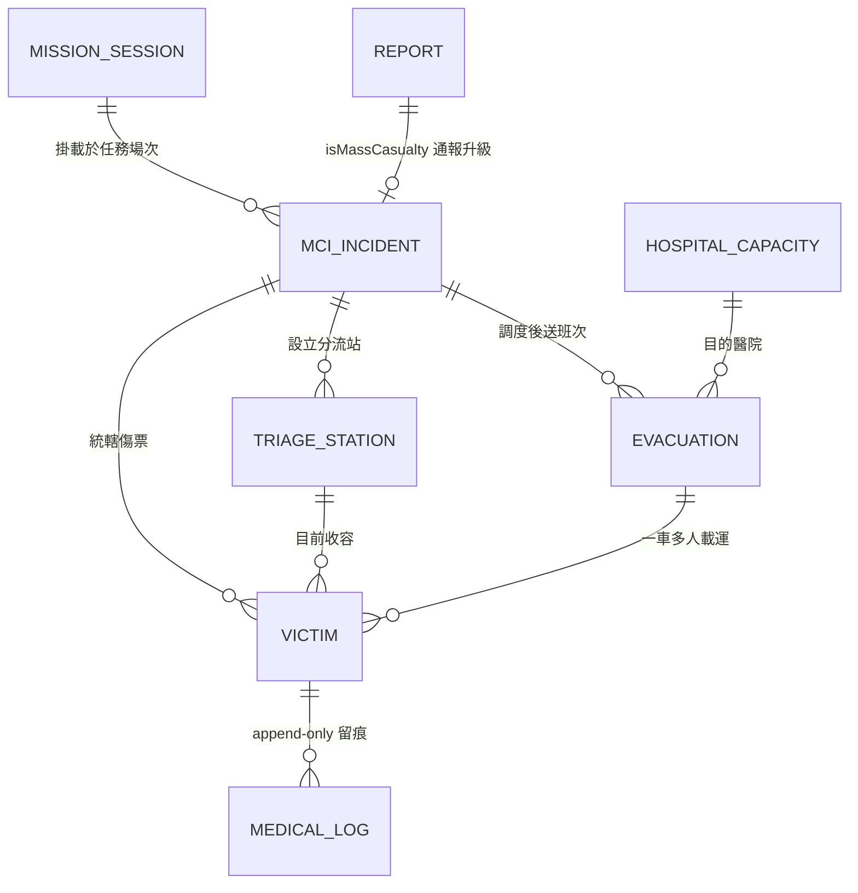
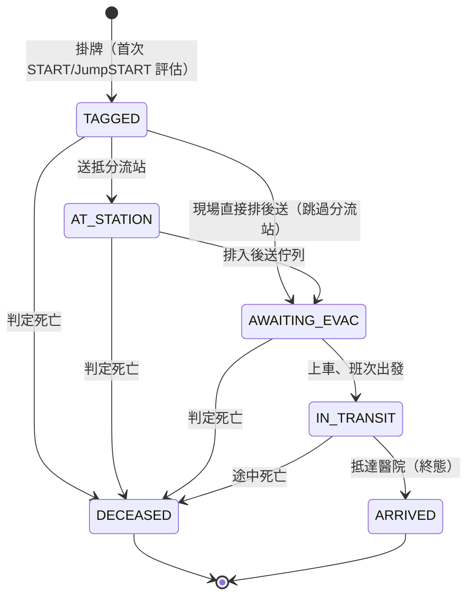

# MCI 大量傷患事件流程設計（CD-3 / C2.1 設計階段）

> 工作項：`FULL_SYSTEM_REDESIGN_PLAN.md` C2.1（CD-3 大量傷患事件 MCI 流程）
> 分工：**FABLE 設計（本文件）→ OPUS 實作（等 1.2 baseline migration / D7 窗口完成後）→ SONNET 依 spec 批次 UI（C2.2）**
> 狀態：純設計文件——本工作項**不含任何程式碼與 migration**。
>
> 相關文件：
> - 災型分類與 MCI 正交旗標論證：`docs/architecture/CIVIL_DEFENSE_TAXONOMY.md` §2.2
> - 設計語言（UI 一律依此）：`docs/architecture/DESIGN_LANGUAGE.md`
> - 離線層規則：`docs/architecture/OFFLINE_LAYER_CONSOLIDATION.md`＋`web-dashboard/src/services/offline/offline.service.ts` 檔頭不變式
> - 既有檢傷模組：`backend/src/modules/triage/`（Victim / MedicalLog / START 演算法）

---

## 0. 摘要與範圍

**MCI（Mass Casualty Incident）**＝單一事件短時間產生大量傷患（地震坍塌、空襲、恐攻、遊覽車事故），
傷患數量超過現場醫療量能，必須以「最大多數人的最大存活」原則分配資源。
現場流程：**START/JumpSTART 檢傷 → 傷票 → 分流站 → 後送 → 醫院**。

平台已有的積木（本設計「升級」而非「另起爐灶」）：

| 既有能力 | 位置 | 在 MCI 中的角色 |
|---|---|---|
| 單人檢傷（START 演算法＋四色） | `triage` 模組：`Victim`／`MedicalLog`、`TriageService.calculateTriageLevel()` | 傷票的評估核心，直接沿用 |
| 四色看板頁（R3a 重建） | `web-dashboard/src/pages/TriagePage.tsx`（路由 `/rescue/triage`） | 分流站看板的基底 |
| MCI 正交旗標 | `reports.isMassCasualty`＋`casualtyEstimate`（migration `1754029200000` 待 D7） | 通報 → MCI 事件的入口訊號 |
| 離線 outbox | `offline.service.ts`（Dexie，`pendingSync`，2xx 才刪） | 傷票離線建立/改判的載體 |
| 任務場次 | `mission_sessions`（v2.1 SSOT Incident） | MCI 事件的掛載點 |
| 雙模式 Shell | `useAppMode.ts`＋tactical dark token 層 | MCI 全部頁面預設在災時模式下運作 |

**範圍內**：領域模型、傷票狀態機與稽核、離線防撞與衝突解決、UI 流程、實作分解。
**範圍外**（本期不做，見 §6 決策點）：與衛福部緊急醫療網（EMS）系統介接、NFC 手環硬體採購、
自動生命徵象感測（穿戴裝置）、醫院端登入介面（醫院容量第一版為**我方人員人工回報**）。

**驗收情境（CD-3 原文）**：演練 50 傷患從掛牌到後送全程可追；斷網下傷票可填、恢復後同步。

---

## 1. 領域模型

### 1.1 核心決策：傷票＝`victims` 表的 MCI 化擴充，不另建第二套傷患模型

單人檢傷就是「n=1 的 MCI」。若另建 `triage_tags` 新表，會出現兩套傷患模型
（`victims` 給日常、新表給 MCI），START 演算法、醫療留痕、運送欄位全部分裂，
且現場人員在「小事故長成 MCI」時需要資料搬家——這在混亂現場不可接受。

因此：**`victims` 表原地升級為傷票（TriageTag）**，加上 MCI 欄位（全部 nullable，
`mciIncidentId IS NULL`＝既有單人檢傷行為，零回歸）。新建的表只有四張：
`mci_incidents`、`triage_stations`、`evacuations`、`hospital_capacities`。

沿用／新建對照：

| 概念 | 落點 | 理由 |
|---|---|---|
| MciIncident | **新表** `mci_incidents` | 全新聚合根；掛在 `mission_sessions` 之下、可由 `reports` 升級而來 |
| TriageTag（傷票） | **沿用擴充** `victims` | 上述；`MedicalLog` 留痕機制（`TRIAGE_UPGRADE`/`TRIAGE_DOWNGRADE`）已存在 |
| 生命徵象時序 | **沿用** `medical_logs`（`metadata` 承載結構化數值） | 已是 append-only 時序表，另建表徒增 join |
| TriageStation | **新表** `triage_stations` | 既有系統無此概念 |
| Evacuation（後送班次） | **新表** `evacuations` | `victims` 現有 `ambulanceId`/`hospitalId` 是「一人一車」欄位；MCI 是**一車多人**，必須升格為獨立聚合 |
| HospitalCapacity | **新表** `hospital_capacities` | 既有 `victims.hospitalName` 是自由文字；容量看板需要結構化實體。刻意**不**塞進 `shelters`（收容所）——語意不同（防空/收容/醫療三分，同 C1.2 的區分原則） |

### 1.2 關聯圖



（`VICTIM`＝傷票 TriageTag；`MISSION_SESSION`／`REPORT`／`MEDICAL_LOG` 為既有表。）

### 1.3 MciIncident（新表 `mci_incidents`）

| 欄位 | 型別 | 說明 |
|---|---|---|
| `id` | uuid PK | **client 端產生**（`crypto.randomUUID()`），離線可建；伺服器以 id 冪等 upsert |
| `missionSessionId` | uuid FK→`mission_sessions` NOT NULL | MCI 必掛任務場次（無場次先建場次——沿用 v2.1 SSOT） |
| `reportId` | uuid FK→`reports` nullable | 由 R2b 通報（`isMassCasualty=true`）升級而來時回填；現場直接開設則為 NULL |
| `code` | varchar(20) UNIQUE | 事件短代號（如 `MCI-0731A`），無線電可唸；伺服器核發，離線期間 UI 顯示「未編」 |
| `title` | varchar(200) | 例：「中山高遊覽車翻覆」 |
| `status` | varchar(20) | `standby`（開設中）/ `active` / `closed`；預設 `active` |
| `commanderId` / `commanderName` | varchar nullable | 現場醫療指揮官（可與 mission commander 不同人） |
| `location` | jsonb nullable | `{lat, lng, address}`（同 `mission_sessions.location` 形狀） |
| `casualtyEstimate` | int nullable | 概估總傷患數；開設時可從 `reports.casualtyEstimate` 帶入 |
| `triageAlgorithm` | varchar(20) | 預設 `START`；保留 `JUMPSTART` 全場覆寫（純小兒場景，如校車事故） |
| `startedAt` / `closedAt` | timestamptz | 開設／結束時間 |
| `createdAt` / `updatedAt` / `deletedAt` | 標準三欄 | soft-delete 同 SEC-SD.1 |

索引：`missionSessionId`、`status`（partial `WHERE status = 'active'`——同 `IDX_reports_mass_casualty` 的稀疏原則）。

### 1.4 TriageTag（沿用 `victims`，新增欄位）

既有欄位**一律不動**（`braceletId`、START 六項評估、`triageLevel`、`transportStatus`、
`hospitalId`/`hospitalName`/`ambulanceId`、`photoUrls`、`discoveryLocation`、assessor 欄位…）。
新增欄位（全部 nullable / 有 default，零回歸）：

| 新欄位 | 型別 | 說明 |
|---|---|---|
| `mciIncidentId` | uuid FK→`mci_incidents` nullable | NULL＝單人檢傷（既有行為分支）；索引（partial `WHERE "mciIncidentId" IS NOT NULL`） |
| `tagNumber` | varchar(20) nullable UNIQUE | **離線防撞傷票編號**（§3.2 格式 `{devicePrefix}-{seq}`，如 `K7F-0012`）；與 `braceletId`（實體 NFC/QR 手環）並存——`tagNumber` 系統產生必有，`braceletId` 綁定實體才有 |
| `tagStatus` | varchar(20) | 狀態機欄位（§2），預設 `TAGGED`；`transportStatus` 保留給單人檢傷相容，MCI 模式以 `tagStatus` 為準（服務層同步映射：`AWAITING_EVAC→PENDING`、`IN_TRANSIT→IN_TRANSIT`、`ARRIVED→ARRIVED`，讓既有 stats/看板不改也對） |
| `triageStationId` | uuid FK→`triage_stations` nullable | 目前所在分流站 |
| `evacuationId` | uuid FK→`evacuations` nullable | 目前所屬後送班次（一車多人：多張傷票指向同一班次） |
| `algorithm` | varchar(20) | `START`（預設）/ `JUMPSTART`；掛牌時依「外觀為兒童（約 1–8 歲 / 8–45kg）」單票切換 |
| `deviceId` | varchar(10) nullable | 建票裝置前綴（§3.2），稽核與除錯用 |
| `clientCreatedAt` | timestamptz nullable | **現場觀察時間**（裝置時鐘）；`createdAt` 是伺服器收件時間，兩者都留（§3.3 衝突解決依此） |

id 產生策略變更（服務層，非 schema）：MCI 傷票的 `id` 由 **client 端產生 uuid**，
`POST` 端點改為冪等 upsert（同 id 重送＝no-op 回 200）——這是離線重試不產生重複傷票的關鍵。
單人檢傷路徑不變（server 端 `PrimaryGeneratedColumn` 行為保留）。

生命徵象時序：不加欄位。每次評估寫一筆 `medical_logs`（`type=TRIAGE_ASSESSMENT`），
`metadata` 統一結構：`{ respiratoryRate, hasRadialPulse, capillaryRefillTime, canFollowCommands, canWalk, breathing, algorithm, resultLevel }`。
傷票詳情頁的生命徵象曲線直接由此時序繪出。

### 1.5 TriageStation（新表 `triage_stations`）

| 欄位 | 型別 | 說明 |
|---|---|---|
| `id` | uuid PK | client 端產生（離線可設站） |
| `mciIncidentId` | uuid FK NOT NULL | 所屬 MCI 事件 |
| `name` | varchar(100) | 例：「北側集傷點」 |
| `type` | varchar(20) | `collection`（集傷）/ `treatment`（治療）/ `transport`（後送）/ `morgue`（遺體安置） |
| `location` | jsonb nullable | `{lat, lng, address}` |
| `leaderId` / `leaderName` | varchar nullable | 站長 |
| `status` | varchar(20) | `active` / `closed` |
| `createdAt` / `updatedAt` / `deletedAt` | 標準三欄 | |

站內即時人數**不存欄位**，一律 `COUNT(victims WHERE triageStationId = x AND tagStatus 未離站)` 聚合——
避免離線多裝置下計數器欄位必然發散。

### 1.6 Evacuation（新表 `evacuations`，一車多人後送班次）

| 欄位 | 型別 | 說明 |
|---|---|---|
| `id` | uuid PK | client 端產生 |
| `mciIncidentId` | uuid FK NOT NULL | |
| `vehicleType` | varchar(20) | `ambulance` / `helicopter` / `bus` / `truck` / `private` / `other` |
| `vehicleCallsign` | varchar(50) | 車號／呼號（自由文字，現場常只知道「消防 91」） |
| `destinationHospitalId` | uuid FK→`hospital_capacities` nullable | 結構化目的醫院 |
| `destinationName` | varchar(100) nullable | 醫院不在名冊時的自由文字後備（兩者擇一必填，服務層驗證） |
| `status` | varchar(20) | `loading`（裝載中）/ `departed`（已出發）/ `arrived`（已抵達）/ `cancelled` |
| `departedAt` / `arrivedAt` | timestamptz nullable | 時間戳（`clientDepartedAt`/`clientArrivedAt` 同 §1.4 雙時戳原則，各加一欄） |
| `escortName` | varchar(100) nullable | 隨車人員 |
| `notes` | text nullable | |
| `createdAt` / `updatedAt` / `deletedAt` | 標準三欄 | |

班次抵達（`status→arrived`）時，服務層將車上所有傷票 `tagStatus→ARRIVED` 並各寫一筆
`medical_logs`（`type=TRANSPORT_ARRIVED`，既有 enum 值直接沿用）。

### 1.7 HospitalCapacity（新表 `hospital_capacities`，人工回報起步）

| 欄位 | 型別 | 說明 |
|---|---|---|
| `id` | uuid PK | |
| `name` | varchar(100) NOT NULL | 醫院名稱 |
| `phone` | varchar(50) nullable | 急診檢傷台電話 |
| `location` | jsonb nullable | `{lat, lng, address}` |
| `level` | varchar(20) nullable | 急救責任醫院分級：`severe`（重度）/ `moderate`（中度）/ `general`（一般）——對照衛福部分級，供分流建議 |
| `status` | varchar(20) | `open` / `crowded`（壅塞）/ `divert`（滿載勿送）；預設 `open` |
| `availableEr` / `availableIcu` / `availableOr` | int nullable | 可收急診／加護／手術；NULL＝未知（**不要**填 0 冒充） |
| `lastReportedAt` | timestamptz nullable | 最後回報時間——UI 必須顯示資料新鮮度（超過 30 分鐘變 warning） |
| `lastReportedBy` | varchar(100) nullable | 回報人 |
| `createdAt` / `updatedAt` / `deletedAt` | 標準三欄 | |

第一版是**平台使用者（聯絡官）打電話問醫院後人工回報**；名冊為全域資料（不掛 MCI 事件），
種子資料可先匯入責任醫院名單。與衛福部即時系統介接為 §6 決策點 D-MCI-3。

### 1.8 與既有模組的整合點與邊界

| 既有模組 | 整合點 | 邊界（刻意不做的事） |
|---|---|---|
| `reports`（R2b 通報） | 確認（`status=confirmed`）且 `isMassCasualty=true` 的通報，詳情頁出現「升級為 MCI 事件」動作 → 建 `mci_incidents`（回填 `reportId`、帶入 `casualtyEstimate`／location） | 不自動升級——是否開設 MCI 是指揮判斷，系統只提示 |
| `mission_sessions` | `mciIncidentId` 必掛場次；MCI 結束不等於場次結束 | 不動 `mission_sessions` schema |
| `triage` 模組 | START 演算法、`MedicalLog` 留痕、既有 8 個端點全部沿用；新端點掛同一模組（`/api/v1/triage/...` 加 `/api/v1/mci/...`） | 不改 `calculateTriageLevel()` 簽名；JumpSTART 另寫 `calculateJumpstartLevel()` 並存 |
| `offline.service.ts` | `OutboxEntity` 聯集擴充（§3.1）；重放規則（2xx 才刪、退避、`retryFailed()`）原封沿用 | 不另建第二套 outbox（OFFLINE_LAYER_CONSOLIDATION 的收斂成果不可回退） |
| `CommandCenterPage` | 既有 `mciQ`（`getReports({isMassCasualty:true})`）升級為 MCI KPI widget（§4.3） | 不新開第二個戰情頁 |
| `shelters` / C1.2 防空設施 | 無資料關聯 | 醫院不是收容所，不共表（§1.1） |

---

## 2. 傷票狀態機

### 2.1 生命週期



補充規則（狀態機之外的正交維度）：

- **檢傷色（`triageLevel`）與流程狀態（`tagStatus`）正交**：任何狀態下都可改判顏色，改判不改變流程狀態
  （例外：改判為 `BLACK` 時服務層將 `tagStatus→DECEASED`，並自動離開後送佇列）。
- `AWAITING_EVAC → AT_STATION` 允許回退（下車重新分流），寫 `STATUS_UPDATE` 留痕。
- `ARRIVED` 與 `DECEASED` 為終態；終態後仍允許**追加** `medical_logs`（補記錄），但不允許改狀態
  （更正錯誤終態＝L3+ 的「稽核更正」動作，寫入更正日誌而非還原，見 §2.3）。

### 2.2 改判（re-triage）規則

START 的精神是快篩，改判是常態（傷情惡化、二次評估更仔細）。規則：

1. **升色（惡化方向 GREEN→YELLOW→RED）**：任何 L1+ 檢傷員可執行，重跑評估表單，
   `calculateTriageLevel()` 重新計算；也允許「手動直升」（不填評估直接升色，需填一行理由）——
   現場惡化常常來不及量生命徵象。留痕 `type=TRIAGE_UPGRADE`（既有 enum）。
2. **降色（好轉方向）**：必須重跑完整評估（不允許手動直降），且需 L2+ 或醫護資格者確認。
   理由：降色錯誤會死人，升色錯誤只浪費資源——不對稱風險用不對稱門檻。留痕 `type=TRIAGE_DOWNGRADE`。
3. **改判為 BLACK（死亡）**：本質是醫療／法律宣告。系統驗證兩段式確認（ConfirmModal，
   DESIGN_LANGUAGE §4 不可逆操作規則），權限層級待 owner 拍板（§6 D-MCI-4），
   設計預設：L2+ 可標記「疑似死亡」，`BLACK` 定案需醫護資格欄位為真的使用者。
4. **BLACK 的回改**：允許（誤判即糾正，升色邏輯同 1），但強制填理由。

### 2.3 稽核要求（法律證據）

MCI 傷票在事後調查、國賠、刑事程序中是證據。硬性要求（OPUS 實作時逐條落地）：

- `medical_logs` 為 **append-only**：服務層不得提供 update/delete；DB 層加防線——
  migration 中對 `medical_logs` 建 `BEFORE UPDATE OR DELETE` 觸發器直接 `RAISE EXCEPTION`
  （soft-delete 也不適用此表；這是本表與其他表的刻意差異）。
- 每次改判寫入 `metadata`：`{ fromLevel, toLevel, reason, assessment?, deviceId, clientObservedAt }`，
  加上既有 `performerId`/`performerName`/`location`/`timestamp`。**改判前後值都在**，不靠 diff 重建。
- 雙時戳：`clientObservedAt`（現場觀察時間）與 `timestamp`（伺服器收件時間）並存；
  UI 顯示前者、審計看兩者（時鐘漂移可被發現）。
- 終態更正不是還原：另寫一筆 `type=NOTE` 的更正記錄（`metadata.correctionOf` 指向原 log id），
  原記錄永不消失。
- 匯出：單一傷票的全歷程可匯出（列印/PDF），含每筆留痕的雙時戳與操作者——這是交給檢警的格式。

---

## 3. 離線優先設計

前提事實：MCI 現場（坍塌區、空襲後）常無網路。**傷票的建立與改判必須 100% 離線可用**，
連線只是同步手段。全部沿用 `offline.service.ts` 的既有機制（Dexie outbox、2xx 才刪、指數退避、
`retryFailed()`），以下只描述增量。

### 3.1 Outbox 擴充

`OutboxEntity` 聯集新增四個值：`'triage_tag'`（建票／改判／狀態轉移）、`'triage_station'`、
`'evacuation'`、`'mci_incident'`。`data` 形狀沿用 report/sos 慣例：`{ missionSessionId, payload }`。

離線可讀：Dexie 新增 `victims` cache table（`id, mciIncidentId, triageStationId, tagStatus, cachedAt`），
上線時每 30 秒拉取本 MCI 傷票快照，斷線時看板讀 cache＋本機未同步項目的合成檢視
（合成規則：outbox 中同 id 的 pending 項目覆蓋 cache 值，UI 標示「待同步」badge——
與 `SyncStatusIndicator` 既有語彙一致）。

**排序關鍵**：同一傷票的多筆 outbox 項目必須**按 `createdAt` 順序重放**（先建票再改判）；
`offline.service.ts` 現行按 id 序重放已滿足（`++id` 自增），OPUS 需在測試中固定此不變式。

### 3.2 傷票編號離線防撞：裝置前綴＋本機序號

需求：編號在**零通訊**下產生、全場唯一、短到能用無線電唸、手寫抄到紙上不出錯。

格式：**`{devicePrefix}-{seq}`**，例 `K7F-0012`。

- `devicePrefix`：3 字元 Crockford Base32（去 I/L/O/U 混淆字元），裝置首次進入 MCI 模式時
  隨機產生，存 `localStorage`（`lk-mci-device-prefix`）＋Dexie `metadata` 雙份。
  空間 32³＝32,768，數十台裝置下生日碰撞機率 <2%；伺服器端 `tagNumber` UNIQUE 約束是最後防線——
  萬一撞號，後同步者收 409，client 以新序號重編並提示使用者（唯一需要人工貼紙更正的罕見情況）。
- `seq`：本機單調遞增計數器（Dexie `metadata`，`lk-mci-tag-seq`），4 位數零填充，**永不重置**
  （跨事件連續，避免「清計數器」造成同裝置重號）。
- 傷票 PK（uuid）與 `tagNumber` 分離：uuid 做冪等 upsert 鍵，`tagNumber` 做人類/無線電識別。
  實體 NFC/QR 手環號（`braceletId`）若現場有發，掃碼綁定，三者互查（既有
  `GET /api/v1/triage/victims/bracelet/:braceletId` 端點模式擴充一個 by-tag-number 查詢）。

### 3.3 恢復連線後的衝突解決

衝突場景：同一傷票，兩台裝置在斷線期間各自改判（例：站內醫護降色、後送員升色），恢復後先後上傳。

規則（**取觀察時間最新＋全歷程保留**）：

1. **歷程零丟失**：兩筆改判都 append 進 `medical_logs`——稽核維度沒有衝突可言，全都是事實。
2. **現值裁決**：`victims.triageLevel`/`tagStatus` 取 `clientObservedAt` **最新**的那筆
   （觀察時間，不是上傳時間——後上傳的舊觀察不能蓋掉先上傳的新觀察）。
3. **平手偏安全**：`clientObservedAt` 相同（秒級平手）時取**較嚴重色**（RED>YELLOW>GREEN；
   BLACK 只依 §2.2-3 規則不參與自動裁決）。寧可過度戒備，不可漏掉惡化。
4. **時鐘防呆**：`clientObservedAt` 晚於伺服器當下 +5 分鐘者，視為時鐘異常，鉗制為伺服器時間
   並在 log `metadata` 註記 `clockSkewClamped: true`（原值保留於 `metadata.rawClientObservedAt`）。
5. 狀態轉移衝突同規則；非法轉移（如對已 `ARRIVED` 的傷票送 `IN_TRANSIT`）不丟棄——
   降級寫成 `STATUS_UPDATE` 留痕（資料不遺失不變式優先於狀態機純潔性），現值不動。

實作落點：裁決全部在**伺服器端** upsert 服務內（單一權威），client 不做 merge。

### 3.4 照片

沿用 `uploadQueue.ts`：離線先存本機 blob、傷票暫存 local URL，上線後上傳補寫 `photoUrls`。
照片是否拍臉／個資議題見 §6 D-MCI-1，設計預設：拍**傷部與傷票**，避免臉部特寫。

---

## 4. UI 流程（依 DESIGN_LANGUAGE）

全部頁面在災時模式（tactical dark）語境下設計；只用語義 token；狀態色嚴格依 §3 色表
（檢傷四色是**醫療語意**專用色，沿用 R3a `TriagePage` 的既有對照：RED=danger、YELLOW=warning、
GREEN=success、BLACK=中性＋標籤文字，不得挪作他用）。

### 4.1 現場檢傷員：單手快速掛牌流（目標 <15 秒/人）

原則：手機直式、單手、全部主要操作在**下半屏**（DESIGN_LANGUAGE §6 單手原則）；
按鈕高度 ≥64px（超過 44px 底線——戴手套）；一屏一問，不捲動；自動的事絕不問人
（編號、時間、GPS 全自動）。

```
┌─────────────────────────┐
│ K7F-0013     ● 離線待同步 │   ← 自動編號＋同步狀態（唸得出來）
│ 14:32  📍已定位           │   ← 自動時戳/GPS，不可編輯
├─────────────────────────┤
│                         │
│   步驟 1/3               │
│   傷患能自行走動嗎？        │   ← 一屏一問，字級 2xl
│                         │
├─────────────────────────┤
│ ┌─────────┐ ┌─────────┐ │
│ │  能走    │ │  不能走  │ │   ← 兩鍵 64px，高對比
│ └─────────┘ └─────────┘ │
│ [兒童模式 JumpSTART]  ⚫死亡│   ← 次要動作縮小靠邊
└─────────────────────────┘
```

流程分支完全對映 `calculateTriageLevel()` 決策樹：

1. 能走？→ 能＝**GREEN 直接完成**（一問結束，之後補拍照可選）。
2. 不能走 → 有呼吸？（打開呼吸道後）→ 無＝**BLACK**（兩段確認）。
3. 有 → 呼吸快慢（>30 或 <10？大按鈕「太快/太慢」「正常」，可略過）→ 異常＝**RED**。
4. 脈搏/微血管回填 → 異常＝**RED**。
5. 服從指令？→ 否＝**RED**；是＝**YELLOW**。

完成畫面：滿版檢傷色底（色＋大字雙通道，色盲防呆）＋編號，停留 1.5 秒自動回步驟 1
（連續掛牌是常態），底部「＋拍照」「＋位置註記」可選追加。
「兒童模式」單票切換 JumpSTART 分支（問法換為 JumpSTART 判準：擺位後呼吸、RR 15–45、
可觸脈搏、AVPU），完成畫面標示 `JS` 字樣。

計時預算：3 次點擊（問答）＋0 輸入＝實測應在 8–12 秒；照片/註記是佇列外的可選項不計入。

### 4.2 分流站看板（`/rescue/triage` 演進，Board archetype §7.3）

R3a 四色看板直接沿用（BLACK/RED/YELLOW/GREEN 四欄、欄頭計數、行動端 segmented tabs），增量：

- 頁首多兩個篩選 chip：**分流站**（下拉，預設全部）、**流程狀態**（掛牌/站內/待後送/運送中/已抵達）。
- 卡片增列：`tagNumber`（等寬數字）、`tagStatus` Badge、所在站。
- 卡片快速動作按狀態機遷移出現：`收站`（TAGGED→AT_STATION）、`排後送`、`上車`（選班次 bottom sheet）、
  `改判`（進評估表單）。非法遷移不顯示按鈕——UI 即狀態機文件。
- 後送站站長視角多一個「班次面板」（右側 Panel／行動端 sheet）：`loading` 中的班次卡
  （車型＋呼號＋目的醫院＋已裝載傷票 chip 列表），一鍵 `出發`。

### 4.3 指揮官 MCI 總覽（接進 CommandCenter 態勢牆）

不開新頁。`CommandCenterPage` 既有 `mciQ` widget（目前只列 `isMassCasualty` 通報）升級為
**MCI KPI widget**（Widget 層，DESIGN_LANGUAGE §4——僅 dashboard 可用 Widget）：

- 無 active MCI：維持現行「MCI 通報列表」＋每列多一個「升級為 MCI」入口（L2+）。
- 有 active MCI：widget 切換為 KPI 面板——四色計數（大字 tabular-nums）、待後送/運送中/已抵達、
  醫院容量摘要（各院 `status` 色點＋可收數＋資料新鮮度，>30 分鐘未更新標 warning）、
  「進入 MCI 指揮視圖」連結至 `/rescue/mci/:id`（詳情頁 archetype：左傷票流水、右站點與班次）。
- 30 秒輪詢節奏沿用 `REFRESH_MS`；斷線時顯示 cache 合成檢視＋離線 badge。

### 4.4 與 R2b 通報頁的銜接

`ReportPage` 既有 MCI 勾選（`isMassCasualty`＋`casualtyEstimate`）**不改**。銜接鏈：

1. 通報送出（可離線，走既有 report outbox）。
2. 審核者於 `ReportsAdminPage`/`EventsPage` 確認通報（既有 MCI badge 已顯示）。
3. 確認後的 MCI 通報詳情出現「升級為 MCI 事件」（L2+）：預填 title/location/casualtyEstimate，
   選掛任務場次（無則順手建）→ 建立 `mci_incidents`，`reportId` 回填。
4. CommandCenter 的 MCI widget 與通報列表自此以 `mciIncidentId` 關聯顯示「已開設」狀態，避免重複開設。

---

## 5. 實作分解（OPUS/SONNET 工作項）

依賴前提：**1.2 baseline migration（D7/D15 窗口）完成後才開 M1**——C1.1 的 migration 都還在排隊，
不再往壞地基上疊新 DDL。順序：M1 → M2 → M3 → {M4, M5} → M6 → M7 → M8。

| # | 工作項 | 執行者 | Migration | 驗收條件 |
|---|---|---|---|---|
| M1 | **Schema**：新表 `mci_incidents`/`triage_stations`/`evacuations`/`hospital_capacities`；`victims` 加 §1.4 欄位；`medical_logs` append-only 觸發器；索引（含 partial） | OPUS | ✅（單一 migration 檔，up/down 完整） | migration up/down 往返乾淨；既有 triage 測試零回歸；`mciIncidentId IS NULL` 路徑行為與現況 byte-for-byte 一致 |
| M2 | **傷票服務**：client-uuid 冪等 upsert、狀態機（合法遷移表＋非法遷移降級留痕）、改判規則（升/降/BLACK 三種門檻）、JumpSTART 演算法、雙時戳、by-tag-number 查詢 | OPUS | — | 單元測試覆蓋狀態機全遷移矩陣＋§2.2 四條規則；同 id 重送 POST 冪等；改判必產生 log 且 log 不可 update/delete |
| M3 | **離線層**：`OutboxEntity` 四值擴充、victims cache table、合成檢視、編號器（prefix＋seq＋409 重編）、伺服器端衝突裁決（§3.3 五條） | OPUS | — | 模擬兩裝置斷線互改同傷票 → 恢復後現值＝最新觀察、歷程兩筆俱在；斷線建 50 票恢復後零丟失零重複（對應 CD-3 驗收） |
| M4 | **MCI 事件服務**：incident CRUD＋lifecycle、report 升級端點、station/evacuation/hospital-capacity CRUD、班次抵達級聯、統計端點（四色×狀態×站） | OPUS | — | 升級端點回填 `reportId` 且不可重複開設；班次 arrived 級聯全車傷票＋留痕；統計與逐筆加總一致 |
| M5 | **掛牌流 UI**（§4.1） | SONNET（依本 spec） | — | 375px 單手可完成；掛 GREEN 3 點擊內；三態（light/dark/tactical）目視；axe 無 nested-interactive；離線建票顯示待同步 badge |
| M6 | **分流站看板＋後送/醫院容量 UI**（§4.2，即原 C2.2 前半） | SONNET | — | 看板篩選/快速動作只出現合法遷移；班次面板一鍵出發；醫院容量新鮮度 warning 正確 |
| M7 | **CommandCenter MCI widget**（§4.3）＋通報升級入口（§4.4） | SONNET | — | 無/有 active MCI 兩態切換；KPI 與 M4 統計端點一致；既有 `mciQ` 測試更新不刪 |
| M8 | **演練 e2e**：50 傷患情境腳本（掛牌→分流→後送→抵達→含 3 筆衝突改判），斷網/恢復全程 | OPUS | — | CD-3 驗收原文全綠；產出演練報告存 `docs/proof/` |

RBAC 對照（`page-policy.ts` 增列，數值待 OPUS 依 ADR-005 六級制核定）：掛牌/改判升色 L1+、
降色與站務 L2+、開設/結束 MCI 與升級通報 L2+、BLACK 定案依 D-MCI-4。

---

## 6. 風險與待 Owner 決策點

風險（設計已內建緩解）：正確性攸關人命（→狀態機非法遷移降級不丟資料、降色高門檻）、
離線衝突（→append-only＋觀察時間裁決）、編號撞號（→UNIQUE 最後防線＋409 重編流程）。

**需 owner 拍板**（未拍板前 OPUS 按「設計預設」欄實作）：

| # | 決策點 | 選項/影響 | 設計預設 |
|---|---|---|---|
| D-MCI-1 | 傷票照片是否允許拍攝可辨識人臉？ | 辨識/尋親有用 vs. 個資與遺體影像倫理；影響欄位遮罩（`sensitive-fields`）與存取層級 | 允許拍攝，僅 L2+ 可檢視原圖，預設顯示縮圖＋遮罩 |
| D-MCI-2 | 傷票＋醫療留痕保存期限與封存策略 | 醫療法病歷 7 年類推？刑事證據可能更久；影響 soft-delete 例外與備份策略（C1.3） | 永久保存、`medical_logs` 排除於任何清理 job |
| D-MCI-3 | 醫院容量是否介接衛福部緊急醫療管理系統（EMS）？ | 介接＝資料即時但有外部依賴與公文流程（併入 C3 政府介接洽談）；人工回報＝立即可用 | 第一版人工回報，名冊種子用公開責任醫院清單 |
| D-MCI-4 | BLACK（死亡）定案權限 | 法律上死亡宣告屬醫師；平台使用者多為志工/EMT。「疑似死亡」與「定案」兩級是否足夠、定案者資格欄位如何驗證 | L2+ 標疑似；定案限「醫護資格」旗標帳號 |
| D-MCI-5 | 實體傷票/NFC 手環採購與並行策略 | 純數位在裝置全滅時失效；紙本傷票＋掃碼綁定最穩但要採購與 SOP（與 C2.3 紙本包相關） | 系統支援 `braceletId` 綁定，採購另案 |
| D-MCI-6 | JumpSTART 是否納入第一版？ | 兒童傷患判準不同，不做則兒童誤判風險；做則多一套演算法與 UI 分支（本設計已含） | 納入（M2/M5 已排） |

---

## 附錄：名詞對照（grep 錨點）

`victims`／`Victim`（傷票載體）、`medical_logs`／`MedicalLog`（留痕）、`TriageLevel`
（BLACK/RED/YELLOW/GREEN）、`TransportStatus`（PENDING/IN_TRANSIT/ARRIVED，相容保留）、
`TreatmentType`（TRIAGE_ASSESSMENT/TRIAGE_UPGRADE/TRIAGE_DOWNGRADE/TRANSPORT_ARRIVED…）、
`reports.isMassCasualty`／`casualtyEstimate`、`mission_sessions`／`MissionSession`、
`OutboxEntity`／`PendingSync`（`offline.service.ts`）、新表：`mci_incidents`／`triage_stations`／
`evacuations`／`hospital_capacities`。
