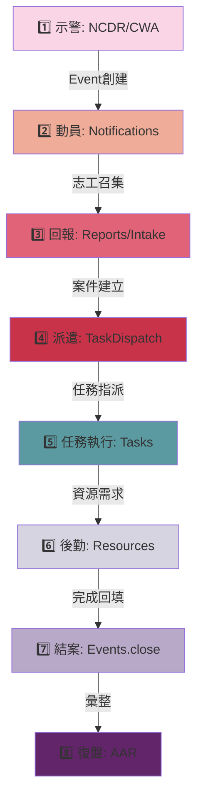

# 整合流程圖 (Integration Map)

> **產出日期**: 2026-01-13  
> **目的**: 端到端流程、模組間資料流、串接點、未串接節點

---

## 🔄 端到端流程：示警 → 動員 → 回報 → 派遣 → 任務 → 資源 → 結案 → 復盤



---

## 1️⃣ 示警階段 (Alert)

### 流程節點

```
NCDR API → ncdr-alerts.service → EventEmitter('ncdr.alert.received')
                                      ↓
                         NotificationsModule (LINE/Push)
                                      ↓
                              Event.create()
```

### 模組串接

| 來源 | 目標 | 串接方式 | 狀態 |
|------|------|----------|:----:|
| `ncdr-alerts` | `events` | EventEmitter | ✅ |
| `ncdr-alerts` | `notifications` | EventEmitter | ✅ |
| `weather-hub` | `weather-alert-integration` | Service import | ✅ |

### ⚠️ 未串接

- ❌ NCDR 警報未自動建立 MissionSession
- ❌ 警報分級未觸發不同通知策略

---

## 2️⃣ 動員階段 (Mobilization)

### 流程節點

```
Event.created → NotificationsService.broadcastToUsers()
                        ↓
    ┌──────────────┬──────────────┬──────────────┐
    ↓              ↓              ↓              ↓
 LINE Bot      FCM Push       SMS (mock)    Email (mock)
    ↓              ↓              ↓              ↓
volunteers.filter(條件篩選?) → assignments.create()
```

### 模組串接

| 來源 | 目標 | 串接方式 | 狀態 |
|------|------|----------|:----:|
| `events` | `notifications` | EventEmitter | ✅ |
| `notifications` | `line-bot` | LineBotModule import | ✅ |
| `notifications` | `volunteers` | Direct call | ⚠️ |

### ❌ 缺口

- **志工召集條件篩選**:
  - 技能匹配 (`volunteer-skill` exists but no API)
  - 距離計算 (需要 PostGIS `ST_Distance`)
  - 裝備/車輛 (`volunteer-vehicle` exists but no filter API)
  - 培訓狀態 (`volunteer-training` exists but no validation)
- **回覆機制**: LINE Bot webhook 接收，但未串接到 `assignments` 狀態更新
- **集合點管理**: overlays 有 `Location` entity，但無集合點專用邏輯

---

## 3️⃣ 災情回報階段 (Reporting)

### 流程節點

```
民眾通報 → intake.controller → Report.create()
                                    ↓
                        ┌───────────┴───────────┐
                        ↓                       ↓
              field-reports (GPS)      photos (uploads)
                        ↓                       ↓
                  去重邏輯?              EXIF validation?
                        ↓
                  案件分級 → Event.reports[]
```

### 模組串接

| 來源 | 目標 | 串接方式 | 狀態 |
|------|------|----------|:----:|
| `intake` | `reports` | Service call | ✅ |
| `reports` | `uploads` | Multer middleware | ✅ |
| `reports` | `field-reports` | FK relation | ✅ |
| `reports` | `events` | FK relation | ⚠️ |

### ❌ 缺口

- **案件去重**:
  - 相同地點 (PostGIS `ST_DWithin`)
  - 相似描述 (文字比對)
  - 時間窗口 (30 分鐘內)
  - **目前狀態**: 無實作
- **案件關聯**:
  - `report_id` 存在於 `tasks` 但無雙向查詢 API
  - 關聯資源僅外鍵，無 audit trail

---

## 4️⃣ 派遣階段 (Dispatch)

### 流程節點

```
Report.created → task-dispatch.service
                        ↓
        ┌──────────────┴──────────────┐
        ↓                              ↓
智慧派遣 (AI Agent)              手動派遣
dispatcher-agent.service      tasks.controller
        ↓                              ↓
        └──────────────┬──────────────┘
                       ↓
            DispatchTask.create()
                       ↓
            TaskAssignment (志工綁定)
                       ↓
        NotificationsModule (通知被派遣志工)
```

### 模組串接

| 來源 | 目標 | 串接方式 | 狀態 |
|------|------|----------|:----:|
| `task-dispatch` | `tasks` | FK relation | ✅ |
| `task-dispatch` | `volunteers/assignments` | FK relation | ✅ |
| `ai` (DispatcherAgent) | `task-dispatch` | Service import | ⚠️ |
| `task-dispatch` | `notifications` | EventEmitter | ❌ |

### ❌ 缺口

- **智慧派遣策略**:
  - 距離優先
  - 技能匹配
  - 負載平衡
  - **目前狀態**: DispatcherAgent 僅框架
- **地圖派遣**: tactical-maps 與 task-dispatch 未串接
- **路徑規劃**: routing module 存在但未整合到派遣流程

---

## 5️⃣ 任務執行階段 (Task Execution)

### 流程節點

```
DispatchTask → Task (status: pending)
                  ↓
        志工簽到 (location tracking?)
                  ↓
        Task.status = 'in_progress'
                  ↓
        現場回報 (field-reports)
                  ↓
        資源消耗 (resource-transaction?)
                  ↓
        Task.status = 'completed'
                  ↓
        志工簽退 (attendance?)
```

### 模組串接

| 來源 | 目標 | 串接方式 | 狀態 |
|------|------|----------|:----:|
| `tasks` | `field-reports` | FK relation | ✅ |
| `tasks` | `location` (tracking) | ❌ | ❌ |
| `tasks` | `attendance` | ❌ | ❌ |
| `tasks` | `resources` | FK relation | ⚠️ |

### ❌ 缺口

- **簽到/簽退**:
  - `attendance` module 存在但未串接到 `tasks`
  - `location` tracking 未觸發簽到事件
- **失聯警報**:
  - location tracking 斷線未觸發警報
  - 離線回傳機制 (`offline-mesh`) 僅 stub
- **即時狀態更新**:
  - WebSocket 推送未串接到任務狀態變更

---

## 6️⃣ 資源後勤階段 (Resources)

### 流程節點

```
Task.resourceNeeds → ResourceMatchingModule (AI?)
                              ↓
                    Resources.reserve()
                              ↓
                    DispatchOrder.create()
                              ↓
        ┌──────────────┬──────────────┬──────────────┐
        ↓              ↓              ↓              ↓
  Warehouse    StorageLocation    Asset     DonationSource
        ↓              ↓              ↓              ↓
        └──────────────┴──────────────┴──────────────┘
                              ↓
              ResourceTransaction (借/領/歸/消耗)
                              ↓
                    InventoryAudit.log()
```

### 模組串接

| 來源 | 目標 | 串接方式 | 狀態 |
|------|------|----------|:----:|
| `tasks` | `resources` | FK relation | ⚠️ |
| `resource-matching` | `resources` | ❌ | ❌ |
| `resources` | `donations` | FK relation | ✅ |
| `resources` | `equipment` | Separate module | ⚠️ |

### ⚠️ 問題

- Resources 模組 **40+ entities** 過於龐大
- resource-matching 與 task-dispatch 未整合
- 車輛/裝備管理 (`equipment`, `volunteer-vehicle`) 分散

---

## 7️⃣ 結案階段 (Closure)

### 流程節點

```
All Tasks.status = 'completed'
            ↓
Event.status = 'resolved'
            ↓
MissionSession.endSession()
            ↓
    ┌──────────┴──────────┐
    ↓                     ↓
SITREP 產出       時間線彙整
(未實作)          (timeline-visualization?)
    ↓                     ↓
    └──────────┬──────────┘
               ↓
     AAR 模板觸發
```

### 模組串接

| 來源 | 目標 | 串接方式 | 狀態 |
|------|------|----------|:----:|
| `events` | `mission-sessions` | FK relation | ✅ |
| `mission-sessions` | `aar-analysis` | ❌ | ❌ |
| `events` | `timeline-visualization` | ❌ | ❌ |

### ❌ 缺口

- **SITREP 自動產出**: 僅模板，無資料填充邏輯
- **時間線關聯**: events → reports → tasks → field-reports 未自動串接
- **成效指標**: 無自動統計（任務完成率、資源消耗、志工出勤）

---

## 8️⃣ 復盤階段 (AAR)

### 流程節點

```
Event.closed → AAR.template.load()
                     ↓
        ┌────────────┴────────────┐
        ↓                         ↓
關聯資料自動填充          手動編輯
- Tasks summary           - 經驗教訓
- Resources used          - 改進建議
- Timeline                - 表揚人員
        ↓                         ↓
        └────────────┬────────────┘
                     ↓
            AAR.publish()
                     ↓
        PDF/Excel 匯出
```

### 模組串接

| 來源 | 目標 | 串接方式 | 狀態 |
|------|------|----------|:----:|
| `aar-analysis` | `events` | ❌ | ❌ |
| `aar-analysis` | `reports-export` | ❌ | ❌ |
| `aar-analysis` | `pdf-generator` | ❌ | ❌ |

### ❌ 缺口

- **AAR 模組目前僅 stub**
- 無自動關聯 IAP/SITREP/Tasks/Resources
- 報表產出未整合

---

## 🔗 橫向整合檢查

### EventEmitter 事件流

| 事件名稱 | 發送者 | 監聽者 | 狀態 |
|----------|--------|--------|:----:|
| `ncdr.alert.received` | ncdr-alerts | notifications, events | ✅ |
| `geofence.enter` | location | push-notification | ✅ |
| `geofence.exit` | location | push-notification | ✅ |
| `emergency.broadcast` | | push-notification | ⚠️ |
| `task.created` | tasks | notifications? | ❌ |
| `task.assigned` | task-dispatch | notifications? | ❌ |
| `task.completed` | tasks | analytics? | ❌ |
| `event.closed` | events | aar-analysis? | ❌ |

### WebSocket 頻道

| 頻道 | 資料流 | 狀態 |
|------|--------|:----:|
| `location/{userId}` | GPS tracking | ⚠️ |
| `task/{taskId}` | 任務狀態更新 | ❌ |
| `event/{eventId}` | 事件態勢 | ❌ |

### 權限守門串接

| Controller | Guard | 狀態 |
|------------|-------|:----:|
| `reports.controller` | UnifiedRolesGuard | ✅ |
| `tasks.controller` | UnifiedRolesGuard | ✅ |
| `resources.controller` | UnifiedRolesGuard + ResourceOwnerGuard | ✅ |
| `webhooks-admin.controller` | UnifiedRolesGuard + RequireLevel | ✅ |
| `task-dispatch.controller` | ❌ | ❌ |
| `aar-analysis.controller` | ❌ | ❌ |

---

## 🚨 未串接 / 重複 / 矛盾節點

### 1. 未串接流程

| 節點 | 影響 | 優先度 |
|------|------|:------:|
| **案件去重** | 重複通報浪費資源 | H |
| **智慧派遣** | 手動派遣效率低 | H |
| **簽到/簽退** | 無法追蹤志工出勤 | H |
| **失聯警報** | 安全風險 | H |
| **SITREP 自動產出** | ICS 不完整 | H |
| **AAR 自動關聯** | 復盤效率低 | M |
| **時間線視覺化** | 態勢掌握不足 | M |

### 2. 重複模組

| 功能 | 重複模組 | 建議 |
|------|----------|------|
| 推播通知 | `notifications`, `push-notification`, `line-notify` | 統一至 NotificationsModule |
| 資源管理 | `resources` (40 entities), `equipment`, `donations` | 簡化 resources |
| 天氣服務 | `weather`, `weather-forecast`, `weather-hub` | ✅ 已整合至 weather-hub |
| AI 服務 | `ai`, `ai-prediction`, `chatbot-assistant` | ✅ 已整合至 AIModule (facade) |

### 3. 矛盾設計

| 項目 | 矛盾點 | 風險 |
|------|--------|:----:|
| 刪除策略 | 部分硬刪 / 部分軟刪 | M |
| 角色模型 | Level (0-5) vs Role (string) | L |
| 地圖整合 | Google Maps vs Mapbox | L |

---

## 📊 資料流依賴圖 (簡化版)

```
NCDR → Events ─┬→ Notifications → Volunteers
               │                        ↓
Reports ───────┤               Assignments
               │                        ↓
FieldReports ──┘                     Tasks ─→ Resources
                                       ↓            ↓
                              Attendance?   Transactions
                                       ↓            ↓
                                   Completed ←─────┘
                                       ↓
                              MissionSessions
                                       ↓
                                   AAR (缺)
```

---

## ✅ 下一步建議

| 優先度 | 任務 | 預估工時 |
|:------:|------|:--------:|
| P0 | 補齊案件去重邏輯 | 8h |
| P0 | 串接簽到/簽退到任務 | 6h |
| P0 | 補齊 TaskDispatch → Notifications 事件 | 4h |
| P1 | 實作智慧派遣條件篩選 | 16h |
| P1 | SITREP 自動產出邏輯 | 12h |
| P1 | AAR 自動關聯資料 | 10h |
| P2 | 時間線視覺化串接 | 8h |

---

**下一步**: 產出 Gap Analysis (B) + Roadmap (F)
