# Agent Execution Plan - Commander Mode

> **Agent**: Antigravity  
> **Mission**: Light Keepers System Audit & Production Readiness  
> **Start Date**: 2026-01-13  
> **Mode**: Commander Mode (Verifiable Evidence Required)

---

## 🎯 Mission Objective

Transform Light Keepers disaster response system from **74% security maturity** → **91% production-ready** through:

1. **Baseline verification** (T0-T1)
2. **P0 blockers resolution** (T2-T7)
3. **Deprecation & cleanup** (T8)
4. **Security hardening** (T7)

**Hard Constraints**:

- All changes must be verifiable (E1-E5 evidence)
- No destructive changes without migration + rollback
- Security is a gate condition
- Split into atomic PRs (no monolithic PRs)

---

## 📊 Task Graph (Updated per Commander Review v2)

> **Key Change**: T7a (Shift-Left Security) now precedes Gate-P0, not after T6.

```mermaid
graph TD
    T0[T0: Baseline ✅] --> T1[T1: Route Mapping ✅]
    T1 --> T7a[T7a: Shift-Left Security]
    T7a --> GATE_P0{Gate-P0}
    
    GATE_P0 --> T2[T2: ICS/C2 MVP]
    GATE_P0 --> T3[T3: Mobilization Loop]
    GATE_P0 --> T4[T4: Report Governance]
    
    T2 --> T5[T5: Dispatch Integration]
    T3 --> T5
    T4 --> T5
    
    T5 --> T6[T6: AAR & Export]
    T6 --> T7bcd[T7b-d: Full Security]
    
    T7bcd --> GATE_SEC{Security Gate}
    GATE_SEC --> T8[T8: Deprecation]
    
    T8 --> GATE_FINAL{Final Gate}
    GATE_FINAL --> PROD[Production Ready]
    
    style T0 fill:#c8e6c9
    style T1 fill:#c8e6c9
    style T7a fill:#fff9c4
    style T2 fill:#ffe6e6
    style T3 fill:#ffe6e6
    style T4 fill:#ffe6e6
    style T5 fill:#ffe6e6
    style T6 fill:#ffe6e6
    style T7bcd fill:#ffcce6
    style T8 fill:#e6f3ff
    style GATE_P0 fill:#fff9c4
    style GATE_SEC fill:#fff9c4
    style GATE_FINAL fill:#fff9c4
    style PROD fill:#c8e6c9
```



---

## 📋 Task Breakdown

### **Phase 0: Baseline** (PR-0)

#### T0: Repo全掃描 ✅ COMPLETE

**Gate**: Phase-0  
**Status**: ✅ COMPLETE  
**Actual**: 2h

**Objectives**:

1. Verify module/page counts match planning documents
2. Identify stub modules, dead code, mock data usage
3. Create evidence baseline for later comparison

**Inputs**:

- Planning documents (00-05)
- Repo codebase (backend/frontend)

**Outputs**:

- `/docs/audit/agent-system-scan.md`
- `/docs/proof/logs/T0-*` (8 evidence files)
- `/docs/proof/index.md` (skeleton)
- `/docs/proof/traceability.md` (skeleton)

**Verification Method**:

```powershell
# Module count
Get-ChildItem backend/src/modules -Directory | Measure-Object
# Expected: 175

# Page count
Get-ChildItem web-dashboard/src/pages -Filter *.tsx -Recurse | Measure-Object  
# Expected: 109

# Stub modules
Select-String -Path "**/*.service.ts" -Pattern "stub|mock|TODO"
```

**Evidence Pack (E1-E5)**:

- **E1**: File listings (T0-modules-list.txt, T0-pages-list.txt)
- **E2**: N/A (no runtime)
- **E3**: Count verification commands
- **E4**: Stub/mock grep results
- **E5**: Module/page count acceptance criteria

**Risks**:

- ⚠️ Count mismatch indicates incomplete planning
- ⚠️ Large number of stubs indicates technical debt

**DoD (Definition of Done)**:

- [ ] Module count: 175 ± 2
- [ ] Page count: 109 ± 2
- [ ] Stub modules catalogued (8 AR/VR modules expected)
- [ ] Evidence files created in /docs/proof/logs/
- [ ] index.md + traceability.md initialized

---

#### T1: Integration Verification

**Gate**: Phase-0  
**Status**: ⏳ PENDING  
**Estimated**: 6h  
**Depends On**: T0

**Objectives**:

1. Verify each node in 02-integration-map.md against actual code
2. Mark API routes, EventEmitter events, Guards as ✅/⚠️/❌
3. Identify missing integration points

**Inputs**:

- `02-integration-map.md`
- Backend controllers/services
- Frontend routing/pages

**Outputs**:

- `/docs/audit/agent-integration-verification.md`
- `/docs/proof/logs/T1-api-routes.txt`
- `/docs/proof/logs/T1-event-emitters.txt`
- `/docs/proof/logs/T1-guards-coverage.txt`

**Verification Method**:

```powershell
# API routes scan
Select-String -Path "**/*.controller.ts" -Pattern "@Get|@Post|@Put|@Patch|@Delete"

# EventEmitter usage
Select-String -Path "**/*.service.ts" -Pattern "eventEmitter.emit|@OnEvent"

# Guard coverage
Select-String -Path "**/*.controller.ts" -Pattern "@UseGuards"
```

**Evidence Pack**:

- **E1**: Route listings, event emitter declarations
- **E2**: Example API calls (3 endpoints minimum)
- **E3**: Guard coverage percentage calculation
- **E4**: Missing integration points list
- **E5**: Integration verification checklist (8 stages × nodes)

**Risks**:

- 🔴 H: Undocumented APIs not captured
- 🟡 M: EventEmitter events may be dynamic/runtime

**DoD**:

- [ ] All 8 integration stages verified (Alert → AAR)
- [ ] Missing integrations documented with severity
- [ ] API route coverage > 90%
- [ ] Guard coverage baseline established

---

### **Phase 1: P0 Blockers** (PR-1 through PR-6)

#### T2: ICS/C2 Minimum Viable

**Gate**: Gate-P0  
**Priority**: P0  
**Status**: ⏳ PENDING  
**Estimated**: 30h (SITREP: 12h, IAP: 10h, CommandChain: 8h)  
**Depends On**: T1

**Objectives**:

1. SITREP auto-generation from event/mission/tasks/resources
2. IAP approval workflow (draft → review → approved → published)
3. Command Chain entity + assignment API

**Requirements** (from Gap Analysis):

- GAP-A-M1: SITREP Auto-Generation
- GAP-A-M2: IAP Approval Workflow
- GAP-A-M3: Command Chain Modeling

**Modules Affected**:

- `mission-sessions` (enhancement)
- `auth` (guards for approval flow)
- `notifications` (approval notifications)

**Evidence Pack**:

- **E1**: Service/DTO code for SITREP/IAP/CommandChain
- **E2**: curl examples:
  - `POST /mission-sessions/:id/sitrep` → 200 + SITREP JSON
  - `POST /mission-sessions/:id/iap` → 201 + IAP w/ status=draft
  - `PATCH /mission-sessions/iap/:id/approve` → 200 (Manager+ only)
- **E3**: Integration tests (3 scenarios each)
- **E4**: Regression: existing mission-sessions API still works
- **E5**: Acceptance:
  - [ ] SITREP includes event summary, task status, resource status
  - [ ] IAP has version tracking + approval chain
  - [ ] Command Chain roles assignable (IC, Operations, Planning, Logistics, Finance)
  - [ ] RBAC: only Manager+ can approve IAP

**Migration**:

```sql
-- command-chain.entity.ts → DB
ALTER TABLE mission_sessions ADD COLUMN command_chain_id UUID;
CREATE TABLE command_chain (...);
```

**Rollback**: Migration down script included

---

#### T3: Mobilization Loop

**Gate**: Gate-P0  
**Priority**: P0  
**Status**: ⏳ PENDING  
**Estimated**: 18h (Filtering: 10h, Tracking: 8h)  
**Depends On**: T1

**Objectives**:

1. Volunteer filtering API with PostGIS distance + skills/vehicle/certs
2. Notification delivery tracking (LINE webhook → assignment status update)
3. Reply mechanism (志工回覆 → automatic status update)

**Requirements**:

- GAP-B-M1: Volunteer Filtering API
- GAP-B-M2: Notification Delivery Tracking

**Modules Affected**:

- `volunteers` (findEligible API)
- `line-bot` (webhook handler enhancement)
- `notifications` (delivery log)

**Evidence Pack**:

- **E1**: volunteers.service.ts findEligible() implementation
- **E2**: curl examples:
  - `POST /volunteers/find-eligible` with criteria → volunteer list
  - LINE webhook simulation → assignment.status = 'accepted'
- **E3**: PostGIS query test (distance calculation)
- **E4**: Regression: existing volunteer APIs intact
- **E5**: Acceptance:
  - [ ] Can filter by skills array
  - [ ] Can filter by distance (PostGIS `ST_DWithin`)
  - [ ] Can filter by vehicle requirement
  - [ ] LINE reply updates assignment status in DB

**Risk**:

- 🔴 H: PostGIS index required for performance (`CREATE INDEX ... USING GIST`)

---

#### T4: Report Governance

**Gate**: Gate-P0  
**Priority**: P0  
**Status**: ⏳ PENDING  
**Estimated**: 18h (Dedup: 8h, SLA: 6h, Relations: 4h)  
**Depends On**: T1

**Objectives**:

1. Duplicate detection (time window + geo proximity + text similarity)
2. SLA monitoring (severity → deadline, scheduler for overdue alerts)
3. Bidirectional relations API (report ↔ tasks/resources/field-reports)

**Requirements**:

- GAP-C-M1: Report Deduplication
- GAP-C-M2: SLA Monitoring
- GAP-C-M3: Bidirectional Relations

**Modules Affected**:

- `reports` (checkDuplicate, SLA fields)
- `scheduler` (SLA cron job)
- `tasks`, `resources`, `field-reports` (findByReport APIs)

**Evidence Pack**:

- **E1**: checkDuplicate() with PostGIS + pg_trgm
- **E2**: curl examples:
  - Duplicate report detection → merge suggestion
  - Overdue report → notification triggered
  - `GET /reports/:id/related` → tasks/resources/field-reports
- **E3**: SLA scheduler test (mock overdue scenario)
- **E4**: Regression: report creation still works
- **E5**: Acceptance:
  - [ ] Duplicates detected within 30min, 100m, 0.6 similarity
  - [ ] SLA deadline calculated from severity
  - [ ] Overdue reports trigger notifications
  - [ ] Related entities queryable bidirectionally

**Migration**:

```sql
ALTER TABLE reports ADD COLUMN sla_deadline TIMESTAMP;
ALTER TABLE reports ADD COLUMN merged_into UUID REFERENCES reports(id);
CREATE INDEX idx_reports_location ON reports USING GIST(location);
CREATE EXTENSION IF NOT EXISTS pg_trgm;
```

---

#### T5: Dispatch Integration

**Gate**: Gate-P0  
**Priority**: P0  
**Status**: ⏳ PENDING  
**Estimated**: 12h (Events: 4h, Check-in/out: 8h)  
**Depends On**: T2, T3, T4

**Objectives**:

1. task-dispatch emits events → notifications listens
2. Check-in/check-out API with GPS validation
3. Task status auto-update on check-in/out

**Requirements**:

- GAP-D-M1: Task Assignment Events
- GAP-D-M2: Check-in/Check-out

**Modules Affected**:

- `task-dispatch` (EventEmitter integration)
- `attendance` (new TaskAttendance entity)
- `notifications` (@OnEvent listener)

**Evidence Pack**:

- **E1**: EventEmitter emit() in task-dispatch.service.ts
- **E2**: curl examples:
  - Task assignment → volunteer receives notification (from logs)
  - `POST /tasks/:id/checkin` with GPS → 200 + attendance record
  - `POST /tasks/:id/checkout` → task.status = 'completed'
- **E3**: EventEmitter test (event fired & handler called)
- **E4**: Regression: manual task assignment still works
- **E5**: Acceptance:
  - [ ] task.assigned event emitted
  - [ ] Notification handler receives event
  - [ ] Check-in validates GPS within task area
  - [ ] Check-out calculates duration

---

#### T6: AAR & Export

**Gate**: Gate-P0  
**Priority**: P0  
**Status**: ⏳ PENDING  
**Estimated**: 24h (AAR: 10h, Timeline: 8h, Export: 6h)  
**Depends On**: T2, T5

**Objectives**:

1. AAR auto-aggregation (event → tasks/reports/resources/volunteers)
2. Timeline API providing structured data for frontend visualization
3. Export AAR to PDF or Excel

**Requirements**:

- GAP-G-M1: AAR Auto-Aggregation
- GAP-G-M2: Timeline Visualization
- GAP-G-M3: Export Integration

**Modules Affected**:

- `aar-analysis` (generateAar service)
- `pdf-generator` or `excel-export`
- `timeline-visualization` (if exists)

**Evidence Pack**:

- **E1**: generateAar() implementation
- **E2**: curl examples:
  - `POST /aar-analysis/generate/:eventId` → AAR JSON
  - `GET /aar-analysis/:id/export?format=pdf` → PDF file
- **E3**: AAR generation test (mock event with tasks/resources)
- **E4**: Regression: existing report exports still work
- **E5**: Acceptance:
  - [ ] AAR includes event summary, timeline, task stats, resource usage
  - [ ] Timeline data structured for frontend rendering
  - [ ] PDF/Excel export works

---

#### T7: Security Gate

**Gate**: Gate-Security  
**Priority**: P0  
**Status**: ⏳ PENDING  
**Estimated**: 34h (Guards: 8h, Masking: 10h, Hash: 6h, Delete: 8h, Baseline: 2h)  
**Depends On**: T2-T6

**Objectives**:

1. 100% guard coverage on sensitive controllers
2. Sensitive data masking interceptor (roleLevel < 3)
3. File upload hash verification (SHA-256)
4. Soft-delete unified (deletedAt column)
5. CORS/CSP/Rate-limit production config

**Requirements**:

- SEC-F-M1: Controller Guard Coverage
- SEC-F-M2: Sensitive Data Masking
- SEC-F-M3: File Integrity
- SEC-F-M4: Delete Strategy

**Modules Affected**:

- All controllers (guard additions)
- `common/interceptors` (SensitiveDataInterceptor)
- `uploads` (hash calculation)
- All core entities (deletedAt migration)

**Evidence Pack**:

- **E1**: Guard coverage matrix (controller → guard mapping)
- **E2**: curl examples:
  - Low-level user → masked phone/address
  - File upload → hash stored
  - Soft-delete → record still in DB with deletedAt
- **E3**: Security scan before/after
- **E4**: Impact assessment (all modules touched)
- **E5**: Acceptance:
  - [ ] All controllers have @UseGuards
  - [ ] High-risk endpoints have minLevel
  - [ ] Sensitive fields masked for roleLevel < 3
  - [ ] File hash verified on retrieval
  - [ ] Core entities support soft-delete + restore

**Migration**:

```sql
ALTER TABLE reports ADD COLUMN deleted_at TIMESTAMP;
ALTER TABLE events ADD COLUMN deleted_at TIMESTAMP;
ALTER TABLE tasks ADD COLUMN deleted_at TIMESTAMP;
ALTER TABLE uploads ADD COLUMN hash VARCHAR(64);
```

---

### **Phase 2: Cleanup** (PR-7)

#### T8: Deprecation & Cleanup

**Gate**: Gate-Deprecation  
**Priority**: P2  
**Status**: ⏳ PENDING  
**Estimated**: 12h  
**Depends On**: T7

**Objectives**:

1. Delete 8 AR/VR stub modules (safe deletion)
2. Archive mock-data to test fixtures
3. Verify no broken imports

**Requirements**:

- DEPR-AR-VR-STUBS: Remove stub modules

**Modules Affected**:

- `ar-field-guidance`, `ar-navigation`, `vr-command`, `drone-swarm`, `robot-rescue`, `blockchain`, `supply-chain-blockchain`, `cesium-3d`

**Evidence Pack**:

- **E1**: git diff --name-only (deleted files)
- **E2**: N/A
- **E3**: `npm run build` success after deletion
- **E4**: grep search before/after (no broken imports)
- **E5**: Acceptance:
  - [ ] 8 modules deleted
  - [ ] app.module.ts imports removed
  - [ ] Backend build passes
  - [ ] No import errors

**Risk**: Low (stubs have no dependencies)

---

## 🚦 Production Gates

### Gate-P0 (P0 Blockers Resolved)

**Entry Criteria**:

- T0, T1 complete with evidence

**Exit Criteria**:

- T2-T6 complete
- All P0 gaps closed (11 items)
- Integration tests passing
- No high-severity security issues

---

### Gate-Security (Security Hardened)

**Entry Criteria**:

- Gate-P0 passed

**Exit Criteria**:

- T7 complete
- Guard coverage 100% (sensitive endpoints)
- Masking/Hash/Soft-delete verified
- Security scan shows no critical/high issues

---

### Gate-Deprecation (Technical Debt Cleared)

**Entry Criteria**:

- Gate-Security passed

**Exit Criteria**:

- T8 complete
- Dead code removed
- Build verification passed

---

### Gate-Final (Production Ready)

**Entry Criteria**:

- All gates passed

**Exit Criteria**:

- All acceptance criteria met (see agent-final-report.md)
- Evidence complete for all tasks
- Traceability matrix updated
- Rollback procedures documented

---

## 📦 PR Strategy

| PR | Tasks | Description | Size | Risk |
|----|-------|-------------|:----:|:----:|
| **PR-0** | T0, T1 | Baseline scan + evidence framework | S | Low |
| **PR-1** | T2 | ICS/C2 (SITREP, IAP, CommandChain) | L | Med |
| **PR-2** | T3 | Mobilization (filtering, tracking) | M | Med |
| **PR-3** | T4 | Report governance (dedup, SLA) | M | Med |
| **PR-4** | T5 | Dispatch integration (events, check-in) | M | Low |
| **PR-5** | T6 | AAR & export | M | Low |
| **PR-6** | T7 | Security gate (guards, masking, hash) | XL | High |
| **PR-7** | T8 | Deprecation cleanup | S | Low |

**Legend**: S=<200 LOC, M=200-500, L=500-1000, XL=>1000

---

## ⚠️ Risk Register

| ID | Risk | Impact | Mitigation | Owner |
|:--:|------|:------:|------------|-------|
| R1 | PostGIS queries too slow | H | Create GiST indexes before T3/T4 | Agent |
| R2 | Security scan finds critical issues | H | Block PR until fixed | Agent |
| R3 | Migration breaks existing data | M | Test on staging + rollback script | Agent |
| R4 | EventEmitter performance issues | M | Monitor in T5, add queue if needed | Agent |
| R5 | Evidence collection too time-consuming | L | Automate with scripts | Agent |

---

## 📈 Success Metrics

| Metric | Baseline | Target | Measure |
|--------|:--------:|:------:|---------|
| Security Maturity | 74% | 91% | Coverage matrix |
| P0 Gaps Closed | 0/11 | 11/11 | Traceability |
| Guard Coverage | ~60% | 100% | Static scan |
| Integration Nodes | ?/8 | 8/8 | Verification doc |
| Dead Code LOC | ? | <100 | Cleanup report |

---

## 🗓️ Timeline Estimate

- **Week 1**: T0-T1 (PR-0), T2 (PR-1), T3-T4 start
- **Week 2**: T3-T4 complete (PR-2, PR-3), T5-T6 (PR-4, PR-5)
- **Week 3**: T7 (PR-6), T8 (PR-7)
- **Week 4**: Final verification, documentation

**Total**: ~148h effort, ~3-4 weeks calendar time (1-2 devs)

---

**Next Action**: Complete T0 (current), then T1, then submit PR-0 for baseline verification.
