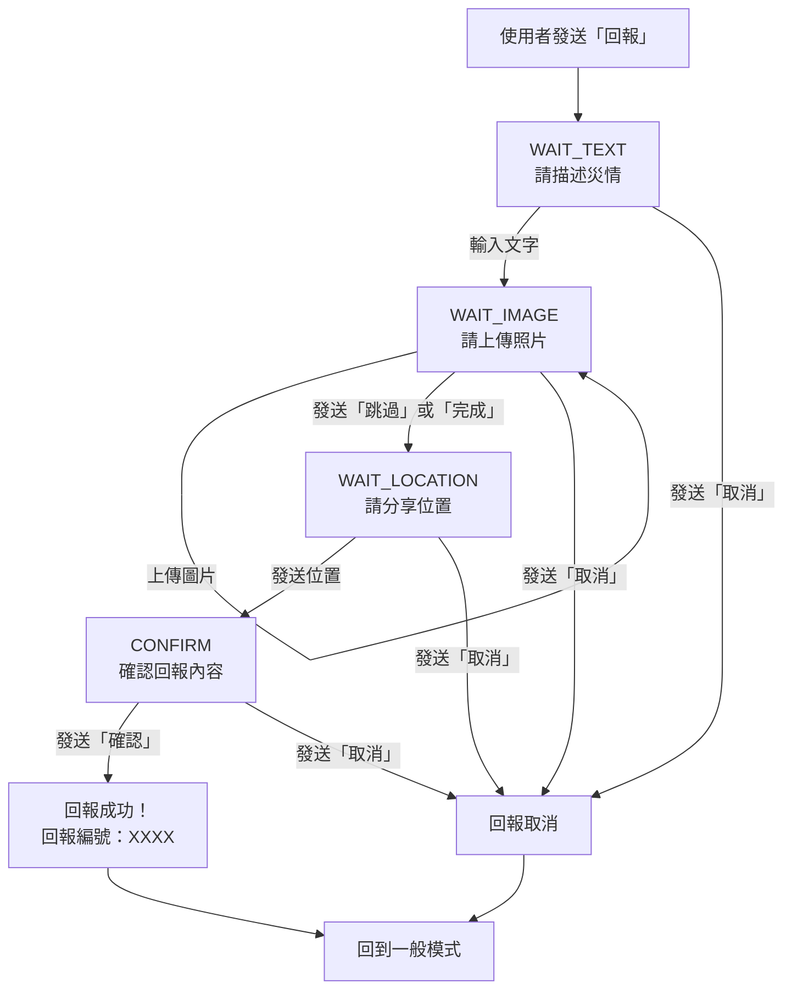

# LINE Bot 災情回報流程文件

> BOT-REPORT-001-05  
> 版本：1.0  
> 更新日期：2025-12-29

---

## 目錄

1. [功能概述](#功能概述)
2. [對話流程圖](#對話流程圖)
3. [狀態機設計](#狀態機設計)
4. [關鍵對話範例](#關鍵對話範例)
5. [錯誤處理範例](#錯誤處理範例)
6. [API 規格](#api-規格)
7. [技術架構](#技術架構)

---

## 功能概述

本 LINE Bot 提供「災情回報」功能，透過多步驟對話引導用戶完成完整的災情回報：

1. **發起回報** - 用戶發送「回報」關鍵字
2. **輸入描述** - 用戶描述災情狀況
3. **上傳照片** - 用戶上傳現場照片（可選）
4. **分享位置** - 用戶分享災情發生地點
5. **確認送出** - 系統確認並建立回報記錄

### 支援的觸發關鍵字

- `回報`
- `災情`
- `通報`
- `報案`

---

## 對話流程圖



---

## 狀態機設計

### 狀態定義

| 狀態 | 說明 | 接受的事件 |
|------|------|------------|
| `IDLE` | 無進行中的回報 | 「回報」關鍵字 |
| `WAIT_TEXT` | 等待災情描述 | 文字訊息 |
| `WAIT_IMAGE` | 等待照片上傳 | 圖片訊息、「跳過」、「完成」 |
| `WAIT_LOCATION` | 等待位置資訊 | 位置訊息 |
| `CONFIRM` | 等待確認送出 | 「確認」、「取消」 |
| `SUBMITTED` | 已送出 | - |

### 通用指令

任何狀態下皆可使用：
- `取消` / `結束` / `放棄` - 取消回報流程

---

## 關鍵對話範例

### 1. 完整成功流程

```text
👤 用戶：回報

🤖 機器人：
🚨 開始災情回報

請描述您看到的災情狀況：
（例：「路樹倒塌阻擋道路」）

💡 輸入「取消」可隨時終止回報

---

👤 用戶：民生東路二段有電線桿倒塌，影響交通

🤖 機器人：
📝 已記錄災情描述！

請上傳現場照片：
（點擊「+」→「相簿」或「相機」）

💡 輸入「跳過」可略過照片上傳

---

👤 用戶：[上傳一張照片]

🤖 機器人：
📷 已收到照片！

可繼續上傳更多照片，或輸入「完成」進入下一步

---

👤 用戶：完成

🤖 機器人：
📍 接下來請分享位置：

點擊「+」→「位置資訊」
→ 選擇災情發生地點

---

👤 用戶：[分享位置：台北市中山區民生東路二段]

🤖 機器人：
📋 請確認回報內容：

📝 描述：民生東路二段有電線桿倒塌，影響交通
📷 照片：1 張
📍 位置：台北市中山區民生東路二段

回覆「確認」送出，或「取消」放棄

---

👤 用戶：確認

🤖 機器人：
✅ 災情回報已送出！

回報編號：A1B2C3D4

我們會盡快處理，感謝您的回報！🙏
```

### 2. 跳過照片流程

```text
👤 用戶：回報

🤖 機器人：🚨 開始災情回報...

👤 用戶：路面有大坑洞，車輛經過很危險

🤖 機器人：📝 已記錄災情描述！請上傳現場照片...

👤 用戶：跳過

🤖 機器人：📍 接下來請分享位置...

[接續位置分享與確認流程]
```

---

## 錯誤處理範例

### 1. WAIT_TEXT 狀態輸入太短

```text
👤 用戶：回報

🤖 機器人：🚨 開始災情回報...

👤 用戶：壞了

🤖 機器人：❓ 請輸入文字描述災情狀況
```

### 2. WAIT_IMAGE 狀態發送文字

```text
[在等待照片狀態]

👤 用戶：我現在沒有照片

🤖 機器人：❓ 請上傳照片或輸入「跳過」
```

### 3. WAIT_LOCATION 狀態發送文字

```text
[在等待位置狀態]

👤 用戶：在民生東路

🤖 機器人：
❓ 請分享位置資訊

點擊「+」→「位置資訊」
```

### 4. 中途取消

```text
[在任何狀態]

👤 用戶：取消

🤖 機器人：❌ 已取消災情回報
```

### 5. Session 超時

```text
[超過 10 分鐘未操作後]

👤 用戶：[任何訊息]

🤖 機器人：⏰ 回報已逾時（10分鐘）

請重新輸入「回報」開始
```

---

## API 規格

### POST /reports（建立回報）

**Request Body：**

```json
{
    "type": "infrastructure",
    "severity": "medium",
    "title": "民生東路二段有電線桿倒塌，影響交通",
    "description": "民生東路二段有電線桿倒塌，影響交通",
    "latitude": 25.0565161,
    "longitude": 121.5451023,
    "address": "台北市中山區民生東路二段",
    "photos": [
        "https://storage.googleapis.com/light-keepers-reports/reports/U123456/1703817600_abc123.jpg"
    ],
    "contactName": "王小明"
}
```

**Response：**

```json
{
    "id": "a1b2c3d4-e5f6-7890-abcd-ef1234567890",
    "type": "infrastructure",
    "status": "pending",
    "createdAt": "2025-12-29T08:30:00.000Z"
}
```

### Webhook 事件格式

**Text Message：**

```json
{
    "type": "message",
    "replyToken": "xxxxxxxx",
    "source": {
        "type": "user",
        "userId": "U1234567890abcdef"
    },
    "message": {
        "type": "text",
        "id": "12345678901234",
        "text": "回報"
    }
}
```

**Image Message：**

```json
{
    "type": "message",
    "replyToken": "xxxxxxxx",
    "source": {
        "type": "user",
        "userId": "U1234567890abcdef"
    },
    "message": {
        "type": "image",
        "id": "12345678901234",
        "contentProvider": {
            "type": "line"
        }
    }
}
```

**Location Message：**

```json
{
    "type": "message",
    "replyToken": "xxxxxxxx",
    "source": {
        "type": "user",
        "userId": "U1234567890abcdef"
    },
    "message": {
        "type": "location",
        "id": "12345678901234",
        "latitude": 25.0565161,
        "longitude": 121.5451023,
        "address": "台北市中山區民生東路二段"
    }
}
```

---

## 技術架構

### 目錄結構

```
backend/src/modules/line-bot/
├── line-bot.controller.ts      # Webhook 入口與事件分派
├── line-bot.service.ts         # LINE API 操作
├── line-bot.module.ts          # 模組定義
│
└── disaster-report/            # 災情回報子模組
    ├── disaster-report.service.ts       # 狀態機控制
    ├── session-state.service.ts         # Session 管理
    ├── image-upload.service.ts          # 圖片上傳
    ├── disaster-report.types.ts         # 型別定義
    ├── disaster-report.constants.ts     # 常數與訊息
    └── index.ts                         # 導出
```

### 狀態存儲

目前使用記憶體存儲 Session，適用於單實例部署。

如需多實例部署，可遷移至：
- **Firestore** - 推薦，無伺服器架構
- **Redis** - 超低延遲

### 圖片處理流程

1. LINE 發送 image message 到 webhook
2. 後端使用 `LINE_CHANNEL_ACCESS_TOKEN` 下載圖片
3. 上傳至 Google Cloud Storage
4. 返回公開 URL 存入 Session

### 安全性

- **簽章驗證**：使用 `X-Line-Signature` 驗證請求來源
- **Session 過期**：10 分鐘自動過期
- **圖片存取**：Cloud Storage 可設定為私有 + 簽名 URL

---

## 環境變數

| 變數名稱 | 說明 | 範例 |
|----------|------|------|
| `LINE_CHANNEL_ACCESS_TOKEN` | Messaging API Access Token | `xxxxx...` |
| `LINE_CHANNEL_SECRET` | Channel Secret（簽章驗證） | `xxxxx...` |
| `GCS_BUCKET_NAME` | Cloud Storage Bucket 名稱 | `light-keepers-reports` |

---

## 測試指南

### 單元測試策略

```typescript
// session-state.service.spec.ts
describe('SessionStateService', () => {
    it('should create new session with WAIT_TEXT state', async () => {
        const session = await service.createSession('U123', 'Test User');
        expect(session.state).toBe(ReportSessionState.WAIT_TEXT);
    });

    it('should return null for expired session', async () => {
        // 設定過期時間為過去
        const session = await service.getSession('U123');
        expect(session).toBeNull();
    });
});
```

### 整合測試

```bash
# 發送模擬 webhook 事件
curl -X POST https://api.lightkeepers.ngo/line-bot/webhook \
  -H "Content-Type: application/json" \
  -H "X-Line-Signature: [valid-signature]" \
  -d '{
    "events": [{
      "type": "message",
      "replyToken": "test",
      "source": { "type": "user", "userId": "U123" },
      "message": { "type": "text", "id": "1", "text": "回報" }
    }]
  }'
```
