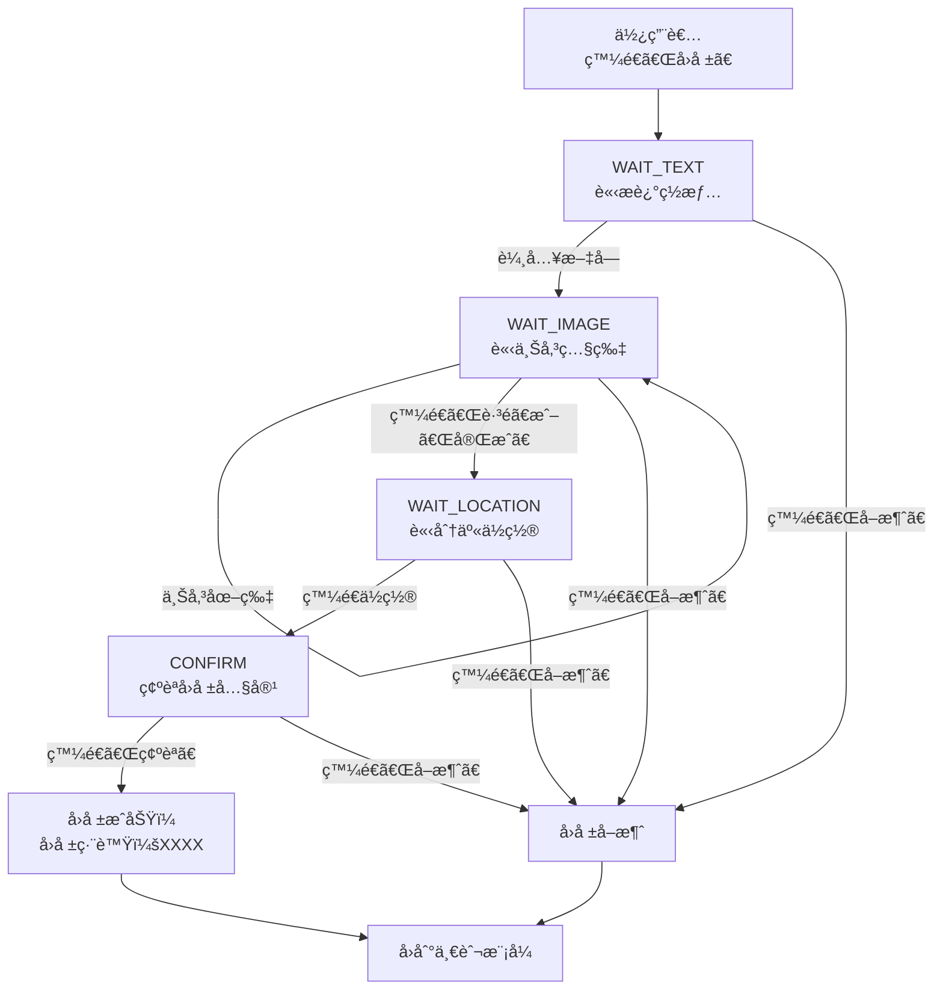

# LINE Bot ç½æƒ…å›å ±æµç¨‹æ–‡ä»¶

> BOT-REPORT-001-05  
> 版本：1.0  
> 更新日期：2025-12-29

---

## 目錄

1. [功能概述](#功能概述)
2. [å°è©±æµç¨‹åœ–](#å°è©±æµç¨‹åœ–)
3. [狀態機設計](#狀態機設計)
4. [é—œéµå°è©±ç¯„例](#é—œéµå°è©±ç¯„例)
5. [錯誤處ç†ç¯„例](#錯誤處ç†ç¯„例)
6. [API è¦æ ¼](#api-è¦æ ¼)
7. [技術æ¶æ§‹](#技術æ¶æ§‹)

---

## 功能概述

本 LINE Bot æ供「ç½æƒ…å›å ±ã€åŠŸèƒ½ï¼Œé€é多步驟å°è©±å¼•å°ç”¨æˆ¶å®Œæˆå®Œæ•´çš„ç½æƒ…å›å ±ï¼š

1. **發起å›å ±** - 用戶發é€ã€Œå›å ±ã€é—œéµå­—
2. **輸入æè¿°** - 用戶æè¿°ç½æƒ…ç‹€æ³
3. **上傳照片** - 用戶上傳ç¾å ´ç…§ç‰‡ï¼ˆå¯é¸ï¼‰
4. **分享ä½ç½®** - 用戶分享ç½æƒ…發生地é»
5. **確èªé€å‡º** - 系統確èªä¸¦å»ºç«‹å›å ±è¨˜éŒ„

### 支æ´çš„觸發關éµå­—

- `å›å ±`
- `ç½æƒ…`
- `通報`
- `報案`

---

## å°è©±æµç¨‹åœ–



---

## 狀態機設計

### 狀態定義

| 狀態 | èªªæ˜ | æ¥å—的事件 |
|------|------|------------|
| `IDLE` | 無進行中的å›å ± | 「å›å ±ã€é—œéµå­— |
| `WAIT_TEXT` | 等待ç½æƒ…æè¿° | æ–‡å­—è¨Šæ¯ |
| `WAIT_IMAGE` | 等待照片上傳 | 圖片訊æ¯ã€ã€Œè·³éã€ã€ã€Œå®Œæˆã€ |
| `WAIT_LOCATION` | 等待ä½ç½®è³‡è¨Š | ä½ç½®è¨Šæ¯ |
| `CONFIRM` | 等待確èªé€å‡º | 「確èªã€ã€ã€Œå–消〠|
| `SUBMITTED` | å·²é€å‡º | - |

### 通用指令

任何狀態下皆å¯ä½¿ç”¨ï¼š
- `å–消` / `çµæŸ` / `放棄` - å–消å›å ±æµç¨‹

---

## é—œéµå°è©±ç¯„例

### 1. 完整æˆåŠŸæµç¨‹

```text
👤 用戶：å›å ±

🤖 機器人：
🚨 開始ç½æƒ…å›å ±

è«‹æ述您看到的ç½æƒ…ç‹€æ³ï¼š
（例：「路樹倒塌阻擋é“è·¯ã€ï¼‰

💡 輸入「å–消ã€å¯éš¨æ™‚終止å›å ±

---

👤 用戶：民生æ±è·¯äºŒæ®µæœ‰é›»ç·šæ¡¿å€’塌，影響交通

🤖 機器人：
📠已記錄ç½æƒ…æè¿°ï¼

請上傳ç¾å ´ç…§ç‰‡ï¼š
（é»æ“Šã€Œ+ã€â†’「相簿ã€æˆ–「相機ã€ï¼‰

💡 輸入「跳éã€å¯ç•¥é照片上傳

---

👤 用戶：[上傳一張照片]

🤖 機器人：
📷 已收到照片ï¼

å¯ç¹¼çºŒä¸Šå‚³æ›´å¤šç…§ç‰‡ï¼Œæˆ–輸入「完æˆã€é€²å…¥ä¸‹ä¸€æ­¥

---

👤 用戶：完æˆ

🤖 機器人：
📠æ¥ä¸‹ä¾†è«‹åˆ†äº«ä½ç½®ï¼š

é»æ“Šã€Œ+ã€â†’「ä½ç½®è³‡è¨Šã€
→ é¸æ“‡ç½æƒ…發生地é»

---

👤 用戶：[分享ä½ç½®ï¼šå°åŒ—市中山å€æ°‘生æ±è·¯äºŒæ®µ]

🤖 機器人：
📋 請確èªå›å ±å…§å®¹ï¼š

📠æ述：民生æ±è·¯äºŒæ®µæœ‰é›»ç·šæ¡¿å€’塌，影響交通
📷 照片：1 張
📠ä½ç½®ï¼šå°åŒ—市中山å€æ°‘生æ±è·¯äºŒæ®µ

å›è¦†ã€Œç¢ºèªã€é€å‡ºï¼Œæˆ–「å–消ã€æ”¾æ£„

---

👤 用戶：確èª

🤖 機器人：
✅ ç½æƒ…å›å ±å·²é€å‡ºï¼

å›å ±ç·¨è™Ÿï¼šA1B2C3D4

我們會盡快處ç†ï¼Œæ„Ÿè¬æ‚¨çš„å›å ±ï¼ğŸ™
```

### 2. è·³é照片æµç¨‹

```text
👤 用戶：å›å ±

🤖 機器人：🚨 開始ç½æƒ…å›å ±...

👤 用戶：路é¢æœ‰å¤§å‘æ´ï¼Œè»Šè¼›ç¶“é很å±éšª

🤖 機器人：📠已記錄ç½æƒ…æè¿°ï¼è«‹ä¸Šå‚³ç¾å ´ç…§ç‰‡...

👤 用戶：跳é

🤖 機器人：📠æ¥ä¸‹ä¾†è«‹åˆ†äº«ä½ç½®...

[æ¥çºŒä½ç½®åˆ†äº«èˆ‡ç¢ºèªæµç¨‹]
```

---

## 錯誤處ç†ç¯„例

### 1. WAIT_TEXT 狀態輸入太短

```text
👤 用戶：å›å ±

🤖 機器人：🚨 開始ç½æƒ…å›å ±...

👤 用戶：å£äº†

🤖 機器人：ⓠ請輸入文字æè¿°ç½æƒ…ç‹€æ³
```

### 2. WAIT_IMAGE 狀態發é€æ–‡å­—

```text
[在等待照片狀態]

👤 用戶：我ç¾åœ¨æ²’有照片

🤖 機器人：ⓠ請上傳照片或輸入「跳éã€
```

### 3. WAIT_LOCATION 狀態發é€æ–‡å­—

```text
[在等待ä½ç½®ç‹€æ…‹]

👤 用戶：在民生æ±è·¯

🤖 機器人：
ⓠ請分享ä½ç½®è³‡è¨Š

é»æ“Šã€Œ+ã€â†’「ä½ç½®è³‡è¨Šã€
```

### 4. 中途å–消

```text
[在任何狀態]

👤 用戶：å–消

🤖 機器人：⌠已å–消ç½æƒ…å›å ±
```

### 5. Session 超時

```text
[超é 10 分é˜æœªæ“作後]

👤 用戶：[任何訊æ¯]

🤖 機器人：Ⱐå›å ±å·²é€¾æ™‚（10分é˜ï¼‰

è«‹é‡æ–°è¼¸å…¥ã€Œå›å ±ã€é–‹å§‹
```

---

## API è¦æ ¼

### POST /reports（建立å›å ±ï¼‰

**Request Body：**

```json
{
    "type": "infrastructure",
    "severity": "medium",
    "title": "民生æ±è·¯äºŒæ®µæœ‰é›»ç·šæ¡¿å€’塌，影響交通",
    "description": "民生æ±è·¯äºŒæ®µæœ‰é›»ç·šæ¡¿å€’塌，影響交通",
    "latitude": 25.0565161,
    "longitude": 121.5451023,
    "address": "å°åŒ—市中山å€æ°‘生æ±è·¯äºŒæ®µ",
    "photos": [
        "https://storage.googleapis.com/light-keepers-reports/reports/U123456/1703817600_abc123.jpg"
    ],
    "contactName": "ç‹å°æ˜"
}
```

**Response：**

```json
{
    "id": "a1b2c3d4-e5f6-7890-abcd-ef1234567890",
    "type": "infrastructure",
    "status": "pending",
    "createdAt": "2025-12-29T08:30:00.000Z"
}
```

### Webhook 事件格å¼

**Text Message：**

```json
{
    "type": "message",
    "replyToken": "xxxxxxxx",
    "source": {
        "type": "user",
        "userId": "U1234567890abcdef"
    },
    "message": {
        "type": "text",
        "id": "12345678901234",
        "text": "å›å ±"
    }
}
```

**Image Message：**

```json
{
    "type": "message",
    "replyToken": "xxxxxxxx",
    "source": {
        "type": "user",
        "userId": "U1234567890abcdef"
    },
    "message": {
        "type": "image",
        "id": "12345678901234",
        "contentProvider": {
            "type": "line"
        }
    }
}
```

**Location Message：**

```json
{
    "type": "message",
    "replyToken": "xxxxxxxx",
    "source": {
        "type": "user",
        "userId": "U1234567890abcdef"
    },
    "message": {
        "type": "location",
        "id": "12345678901234",
        "latitude": 25.0565161,
        "longitude": 121.5451023,
        "address": "å°åŒ—市中山å€æ°‘生æ±è·¯äºŒæ®µ"
    }
}
```

---

## 技術æ¶æ§‹

### 目錄çµæ§‹

```
backend/src/modules/line-bot/
├── line-bot.controller.ts      # Webhook å…¥å£èˆ‡äº‹ä»¶åˆ†æ´¾
├── line-bot.service.ts         # LINE API æ“作
├── line-bot.module.ts          # 模組定義
│
└── disaster-report/            # ç½æƒ…å›å ±å­æ¨¡çµ„
    ├── disaster-report.service.ts       # 狀態機æ§åˆ¶
    ├── session-state.service.ts         # Session 管ç†
    ├── image-upload.service.ts          # 圖片上傳
    ├── disaster-report.types.ts         # å‹åˆ¥å®šç¾©
    ├── disaster-report.constants.ts     # 常數與訊æ¯
    └── index.ts                         # å°å‡º
```

### 狀態存儲

ç›®å‰ä½¿ç”¨è¨˜æ†¶é«”存儲 Session，é©ç”¨æ–¼å–®å¯¦ä¾‹éƒ¨ç½²ã€‚

如需多實例部署，å¯é·ç§»è‡³ï¼š
- **Firestore** - æ¨è–¦ï¼Œç„¡ä¼ºæœå™¨æ¶æ§‹
- **Redis** - 超ä½å»¶é²

### 圖片處ç†æµç¨‹

1. LINE ç™¼é€ image message 到 webhook
2. 後端使用 `LINE_CHANNEL_ACCESS_TOKEN` 下載圖片
3. 上傳至 Google Cloud Storage
4. è¿”å›å…¬é–‹ URL 存入 Session

### 安全性

- **簽章驗證**：使用 `X-Line-Signature` 驗證請求來æº
- **Session é期**：10 分é˜è‡ªå‹•é期
- **圖片存å–**：Cloud Storage å¯è¨­å®šç‚ºç§æœ‰ + ç°½å URL

---

## 環境變數

| 變數å稱 | èªªæ˜ | 範例 |
|----------|------|------|
| `LINE_CHANNEL_ACCESS_TOKEN` | Messaging API Access Token | `xxxxx...` |
| `LINE_CHANNEL_SECRET` | Channel Secret（簽章驗證） | `xxxxx...` |
| `GCS_BUCKET_NAME` | Cloud Storage Bucket å稱 | `light-keepers-reports` |

---

## 測試指å—

### 單元測試策略

```typescript
// session-state.service.spec.ts
describe('SessionStateService', () => {
    it('should create new session with WAIT_TEXT state', async () => {
        const session = await service.createSession('U123', 'Test User');
        expect(session.state).toBe(ReportSessionState.WAIT_TEXT);
    });

    it('should return null for expired session', async () => {
        // 設定é期時間為éå»
        const session = await service.getSession('U123');
        expect(session).toBeNull();
    });
});
```

### æ•´åˆæ¸¬è©¦

```bash
# 發é€æ¨¡æ“¬ webhook 事件
curl -X POST https://api.lightkeepers.ngo/line-bot/webhook \
  -H "Content-Type: application/json" \
  -H "X-Line-Signature: [valid-signature]" \
  -d '{
    "events": [{
      "type": "message",
      "replyToken": "test",
      "source": { "type": "user", "userId": "U123" },
      "message": { "type": "text", "id": "1", "text": "å›å ±" }
    }]
  }'
```
